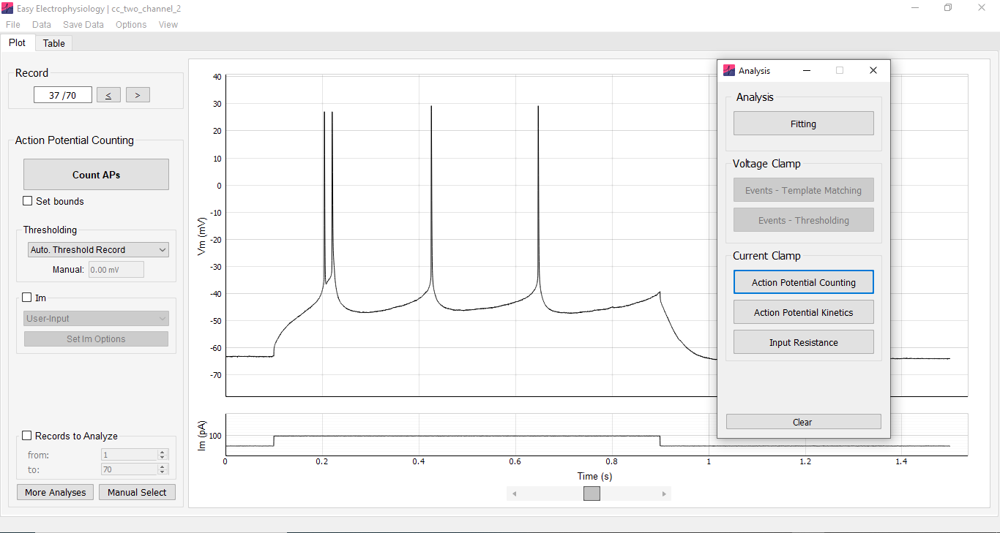

The 'Analysis' window is used to switch between analysis types and can be accessed through 'File' \> 'Open Analysis Window' (Fig. 6).

The analyses available to are determined by the file recording type. *Curve Fitting* and *Event* detection is supported for both voltage-clamp and current-clamp recordings. *Action Potential Counting, Action Potential Kinetics* and *Input Resistance* are available only for current-clamp recordings.

For maximum flexibility, each analysis type is independent and can be run concurrently. This means it is possible to switch from one analysis type to another mid-analysis without overwriting results. The relevant plots and results tables will be updated on analysis change.

