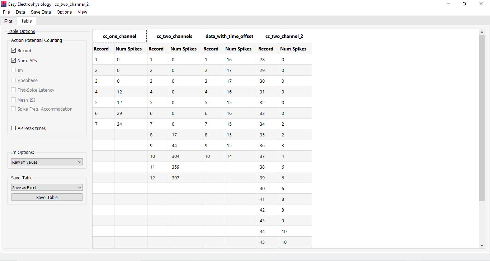

When *Batch Mode* is off, loading a new file will clear all analyses from the previous file.

Turning *Batch Mode* on ('File' \> 'Batch Mode' \> 'On') causes a files analysis results to be saved in the 'Table' tab results table (Fig. 35). If analysis is run on a file then a new file is loaded, all results from this new file are appended to the end of the table. For each file, re-analysis will overwrite the results for that file only (unless a *Data Tools* method has been run between the two analyses in which case they are both displayed).

It is not possible to mix current clamp and voltage clamp recordings in *Batch Mode.* To load a voltage clamp file after a current clap file (or vice-versa) it will be necessary to turn off *Batch Mode* (which will clear the results table on new file load).

In batch mode, 'Records to Analyze' settings will not be changed when the next file is loaded (by default, they are set to the start / stop times of the new file).

In *Batch Mode* analysis can be deleted from the analysis results table by right-clicking the first row of the table and selected 'Delete analysis'.
