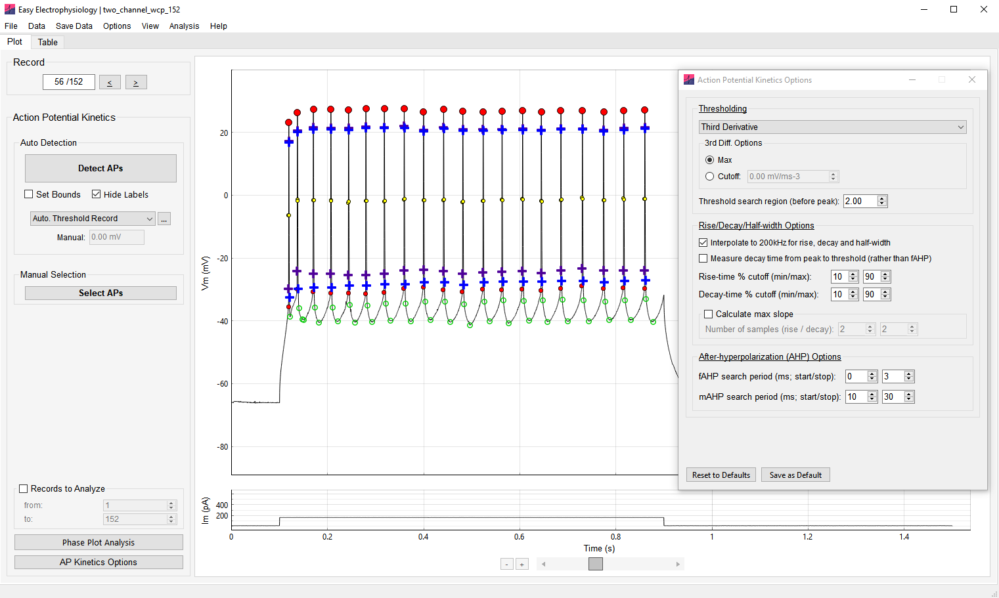
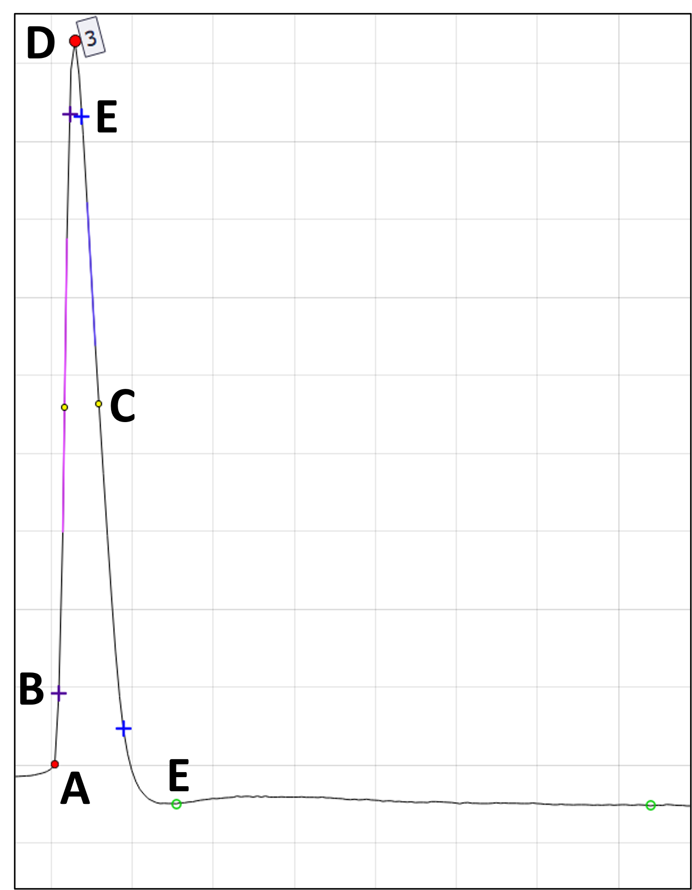
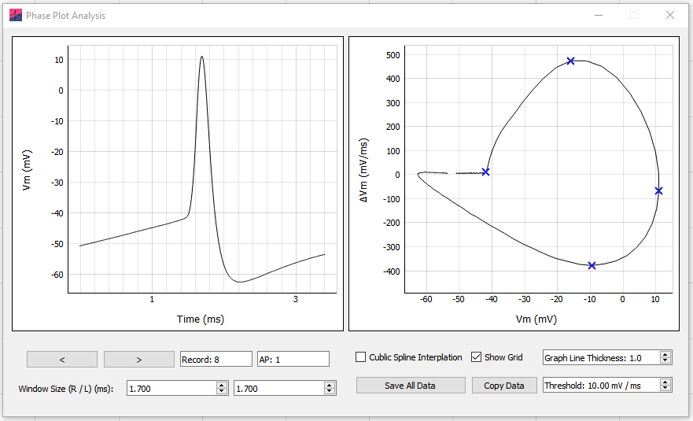

*Action Potential Kinetics* analysis calculates AP threshold, amplitude, half-width, rise and decay-time, fast- and medium- after-hyperpolarization (fAHP, mAHP respectively).

Options for automatic detection and manual selection of APs are available. For details on automatic spike detection, please see the *Action Potential Counting* section of this manual.

## Action potential detection

The action potential kinetics algorithm works by first identifying the action potential peak, calculating the threshold, then calculating the additional measures.

{width="6.695833333333334in" height="4.010416666666667in"}

## Action potential kinetics overview

**A** *Threshold --* The threshold value for the AP. The period to search for the threshold (prior to the peak) can be set in *Threshold Search Region (ms)*. The method used to detect the threshold can be set in *Threshold Detection Method*.

**B** *Rise-time --* The rise-time is calculated as the time between two samples specified as a percentage of the AP amplitude (displayed with the purple cross; default 10-90). The percentage cut-offs can be set using the *Rise-time % Cutoff* option.

***C** Half-width* *--* This is the time between the two half-amplitude samples (on the rise and decay; displayed on the plot with black-bordered filled yellow circles). The nearest samples to the 'true' half-amplitude are used to calculate the FWHM; as such *Interpolate to 200 kHz for rise, decay and half-width* can greatly improve accuracy.

**D** *Peak --* The action potential peak

**E** *Decay-time --* The decay time is measured as the time between two samples specified as a percentage of AP amplitude (displayed with the blue cross, default 10-90). The percentage cutoffs can be specified with *Decay-time % cutoff* and the decay endpoint can be specified using *Measure decay time from peak to threshold (rather than fAHP)*.

**F** *Afterhyperpolarization --* The fast- (fAHP) and medium (mAHP) afterhyperpolarization is calculated as baseline minus fAHP or mAHP value. The fAHP or mAHP value (displayed using an open green circle) is the minimum value within a search region that can be specified using the *After-hyperpolarization (AHP) options*.

## [Action Potential Kinetics Options]{.ui-label}

Options can be accessed from the [Action Potential Kinetics Options]{.ui-label} button at the bottom of the *Action Potential Kinetics* panel or by clicking [Options]{.ui-label} › [Action Potential Kinetics Options]{.ui-label}.

*Threshold Detection Method*

A number of threshold detection methods are available from the [Thresholding]{.ui-label} dropdown menu (see *Appendix I* for mathematical formulas). Once an AP peak is detected, the detection method is applied to a region prior to the peak with window size specified in *threshold search region.* The detected threshold is plot on the AP with a closed red circle. The threshold is calculated as the Vm which maximizes or minimizes the following functions (see *Appendix I* for details):

-   *First Derivative* --

    -   *Maximum* -- The maximum of the first derivative.

    -   *Cutoff* -- The first sample that the first derivative passes the cutoff value*.* A value of 20 mV/ms usually works well.

-   *Third Derivative* --

    -   *Maximum* -- The maximum of the third derivative.

    -   *Cutoff* -- The first sample that the third derivative passes the cutoff value.

-   *Method I (Sekerli et al., 2004)* -- Method I of the phase-space methods introduced in Sekerli et al., 2004). Samples with first derivative under the lower value are excluded as potential thresholds; the default value typically works well.

-   *Method II (Sekerli et al., 2004).* First derivative lower bound may be specified similar to *Method I*.

-   *Leading Inflection --* minimum of the first derivative.

-   *Maximum Curvature --* introduced in Rossokhin and Saakian (1992).

*Threshold Search Region (ms)*

The period prior to the peak (in ms) to search the Vm data for the AP threshold .

*Half-width, rise- and decay-times*

The decay-time can be measured from the peak to fAHP (default) or to the closest sample in the repolarizing phase to the action potential threshold (when box checked).

*Interpolate to 200 kHz for rise, decay and half-width*

Interpolate the data (linear) to a sampling rate of 200 kHz prior to calculation of the half-width, rise and decay-times. This is recommended to improve accuracy of measured kinetics.

*Measure decay-time from peak to threshold (rather than fAHP)*

When this option is set, the decay amplitude is measured from the AP peak to the fAHP. By default (i.e. when this option is unchecked), the decay amplitude is measured from the AP peak to the first sample that the decay crosses the AP threshold. The *Decay-time % cutoff* is calculated on the decay amplitude.

*Rise-time % Cutoff*

By default, the 10-90 rise-time is calculated. The percentage cutoff values for the rise-time can be changed using this option.

*Decay-time % Cutoff*

By default, a 10-90 decay-time is calculated from the decay amplitude (time from peak to fAHP or threshold value, depending on settings). These percentage cutoff values for the decay-time can be changed using this option.

*Calculate Max Slope*

The maximum rise and decay for each AP will be calculated if this option is selected (it is not calculated by default as it can increase analysis time).

The maximum slope is calculated as a regression over n points. The number of samples to calculate the regression over can be specified separately for the rise and decay.

*After-hyperpolarization (AHP) options*

Set the time period to search for the fast- and medium- afterhyperpolarization (fAHP and mAHP respectively). The fAHP and mAHP are plot on the AP with open green circles.

The mAHP is defined as the period after the AP peak (to measure the voltage sag at end of a current injection to which mAHP sometimes refers, see *Input Resistance,* Sag / Hump analysis).

## Phase plot analysis

Phase plot analysis of action potentials is available under *AP Kinetics* analysis. After an analysis has been run, the [Phase Plot Analysis]{.ui-label} button on the bottom-left of the *AP Kinetics* panel will bring up the phase plot analysis window.

The phase plot analysis window contains two panels. On the left panel is displayed the currently selected AP, while the right panel contains the phase-space plot of the currently selected AP.

*Selecting APs*

All analyzed APs can be selected for phase-space analysis. APs can be selected by iterating through all APs using the [<]{.ui-label} or [>]{.ui-label} buttons, or directly inputting the Record / AP number into the [Record / AP number]{.ui-label} boxes.

The window size (+/-) (ms) allows adjustment of the windowing for the selected AP. Increasing or decreasing the AP window will change both the AP plot and the phase-space plot, affecting the phase-plot results. In practice, this is often used to adjust the start-point of the analysis close to the AP threshold.

In theory, it is also possible to increase the window to create phase-space plots of multiple APs. However, the phase-space plot parameters will be calculated only once on a phase-space plot.

{width="5.934763779527559in" height="3.576388888888889in"}

## *Phase plot analysis*

Phase-space plot graphs the first derivative of the Vm (ΔVm, in mV/ms) (y-axis) against the Vm (x-axis). This is interpreted as the rate at which the Vm changes at each voltage level.

When the Vm increases (left-to-right on the x-axis) the positive first derivative indicates the rate-of-increase in the positive direction (i.e. the rising phase of the AP), and we can see the dynamics of the AP rise. The negative first derivative indicates the negative rate-of-change (i.e. the falling phase of the AP). We can see the AP hyperpolarization, the negative rate-of Vm change occurring at voltages smaller than \~-40 mV.

*Phase Plot Parameters*

The calculated parameters from the phase-space plot are the Threshold (see above), maximum ΔVm, minimum ΔVm and maximum Vm. Note the threshold and maximum Vm are equivalent to the AP threshold and peak.

Results can be obtained in a number of ways:

Right-click the plot, select [Copy Parameters]{.ui-label} to copy the Record, AP number, AP peak time, and (ΔVm, Vm) coordinates (i.e. x, y coordinates) of the Threshold, maximum ΔVm, minimum ΔVm and maximum Vm to clipboard.

[Copy Data]{.ui-label} will copy the above parameters, as well as the raw values of all plots (i.e. the AP (time and Vm) and phase-space plot (ΔVm and Vm). Note the Vm will be equivalent unless interpolated.

[Save All Data]{.ui-label} will save the AP phase plot parameters, AP and phase-plot values for every analyzed AP into an excel or `.csv` file.

*Analysis Options*

[Cubic Spline Interpolation:]{.ui-label} Interpolates the phase-space plot, in a smooth manner (ensuring up to 3rd derivatives at interpolated 'knots' are continuous, interpolation factor 100). This can be useful when the AP is not well sampled.

[Threshold (mV/ms):]{.ui-label} A simple thresholding approach is used to calculate the AP threshold from the phase-space plot. The AP threshold is taken as the Vm at which the first derivative crosses this threshold setting (mV/ms).

*Graph Options*

[Show Grid:]{.ui-label} Toggle on and off the AP plot and phase-plot grid

[Graph Line Thickness:]{.ui-label} Adjust the thickness of the AP plot and phase-plot graph lines. Note due to a bug in the underlying graphing software, line thickness > 1 may reduce performance.
