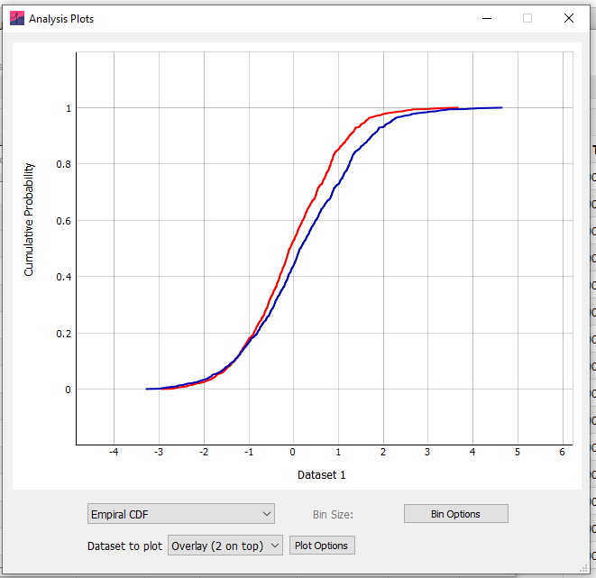
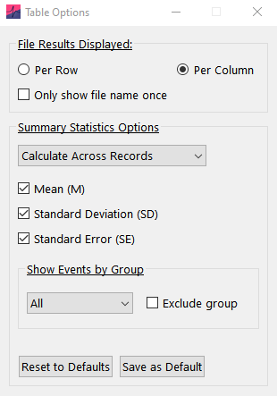

## Kolmogorov-Smirnov tests

Kolmogorov-Smirnov (KS) tests for comparing the distribution of one sample (against the normal distribution) or two samples (against each other) are available at [Analysis]{.ui-label} › [Kolmogorov-Smirnov]{.ui-label}. Raw data can be copied directly into the input data table (it is not necessary to calculate the cumulative distribution first).

The KS test compares two distributions by taking the maximum absolute difference of their cumulative (or empirical) distribution functions (CDF), termed *D*. Hypothesis testing is performed against the Kolmogorov distribution.

For one-sample tests, the empirical CDF of the entered data is compared against the normal (i.e. Gaussian) CDF. Where the mean and standard deviation of this Gaussian in estimated from the data, Lilliefors correction is used.

To plot the empirical CDF, click [Plot Data]{.ui-label} and select [Empirical CDF]{.ui-label} from the drop-down menu.

Easy Electrophysiology uses the SciPy module `kstest` for Kolmogorov-Smirnvov tests, except for the case in which Lilliefors correction is used, where the statsmodel package function `lilliefors` is used.

{width="4.147222222222222in" height="3.9875in"}

## Summary statistics

Summary statistics can be calculated from data displayed on the results table. Clicking the [summary statistics]{.ui-label} checkbox on the table tab panel will display (by default) the mean, standard deviation and standard error of each parameter, for each file analyzed.

To change the calculated parameters, click [Analysis]{.ui-label} › [Table Options]{.ui-label}. Parameters with meaningless summary statistics (e.g. record number, event times) are not calculated. In addition, a [count]{.ui-label} column is shown that displays the number of rows that were summarized. For *Events* and *AP Kinetics,* this will equal the number of events and action potentials summarized. For all other analyses, this will equal the number of records summarized.

This window also provides the option to display results with analyzed files stacked vertically ([per row]{.ui-label}) rather than horizontally ([per column]{.ui-label}).

{width="3.229617235345582in" height="4.615227471566055in"}
