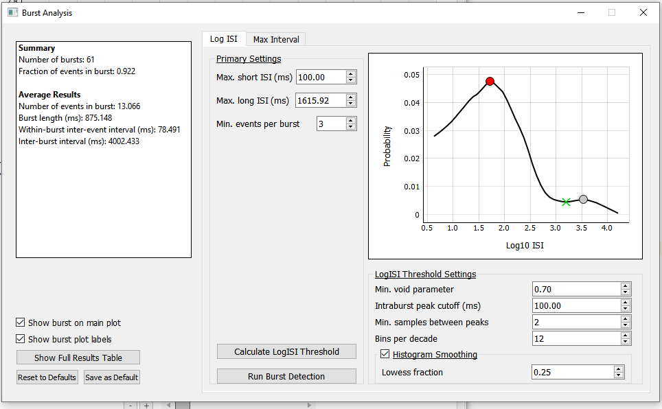
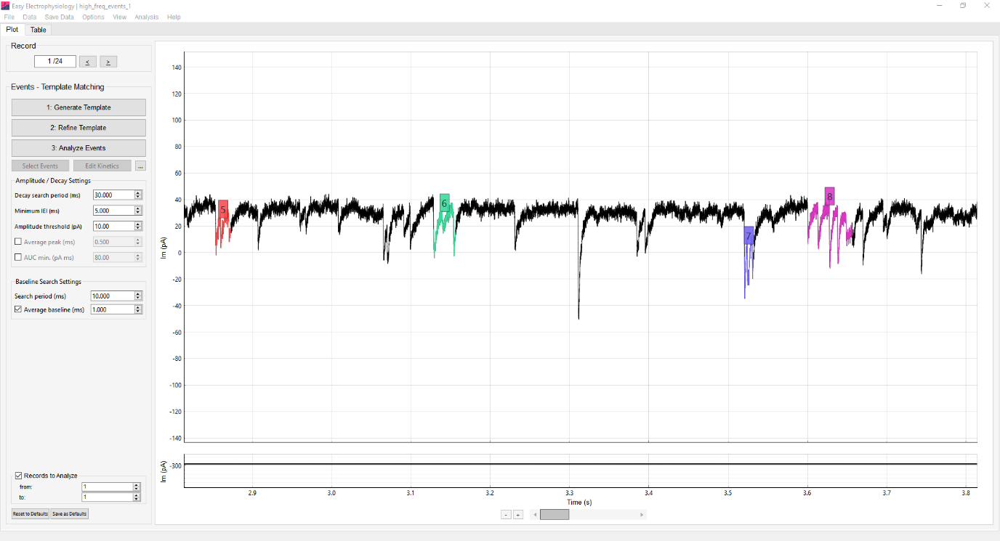
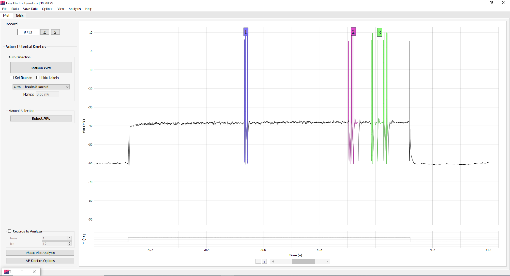

*Burst Analysis* is available after [*Events Template Matching*](event-detection-and-analysis.qmd#template-matching), [*Events Thresholding*](event-detection-and-analysis.qmd#events-thresholding), or [*AP Kinetics*](action-potential-kinetics.qmd) analysis. These analyses detect the events or action potentials that are grouped into bursts. After running one of them, open *Burst Analysis* from [Analysis]{.ui-label} › [Burst Analysis]{.ui-label}.

Two methods for *Burst Analysis* are provided: **LogISI** and **MaxInterval**, both of which were found to perform robustly across datasets by @cotterill2016.

## Burst analysis parameters

{width="8.1in" height="4.9in"}

[Run Burst Detection]{.ui-label} automatically detects bursts using the selected method and calculates the burst summary.

When *Burst Analysis* is run, the main plot updates to display the detected bursts. Toggle [Show burst on main plot]{.ui-label} to switch the burst display on or off. [Show burst plot labels]{.ui-label} controls the automatically generated burst labels.

Note that in the software, a detected spike or event is called 'spike' in *AP Kinetics* mode and an 'event' in *Events* mode. 

{width="8.6in" height="4.7in"}

### Summary statistics

The burst summary statistics are displayed on the left-hand panel of the burst analysis window, as well as in the results table ([Show Full Results Table]{.ui-label}).

-   [Total number of bursts]{.ui-label} -- Total number of detected bursts in the dataset.

-   [Fraction of spikes/events in burst]{.ui-label} -- Proportion of detected spikes or events that belong to a burst, calculated as the number in bursts divided by the total number detected.

### Averages

-   [Number of spikes/events per burst]{.ui-label} -- Average number of spikes or events in a burst.

-   [Burst length (ms)]{.ui-label} -- Average burst duration in milliseconds.

-   [Within-burst inter-spike/inter-event interval (ms)]{.ui-label} -- Average interval between consecutive spikes or events within a burst.

-   [Inter-burst interval (ms)]{.ui-label} -- Average interval between successive bursts in milliseconds.

{width="8.6in" height="4.7in"}

### Per-burst statistics

The results table reports the following values for each burst:

-   [Peaks in Burst]{.ui-label} -- Number of spikes or events in the burst.

-   [Burst Length]{.ui-label} -- Duration of the burst.

-   [Intra-burst interval]{.ui-label} -- Mean interval between consecutive spikes or events within the burst.

For each detected spike or event, the table also reports its [Record]{.ui-label}, [Peak Time]{.ui-label}, and [In Burst]{.ui-label} value. [In Burst]{.ui-label} identifies the burst or shows `N/A` when the spike or event is not in a burst.

[Reset to Defaults]{.ui-label} restores the default *Burst Analysis* options. [Save as Default]{.ui-label} saves the current options as the defaults for future use.

## Burst detection methods

### Log ISI

The **LogISI** method [@pasquale2010] extends *Burst Analysis* to hard-to-detect burst boundaries by calculating an additional inter-spike interval threshold from the logarithmically scaled histogram of ISIs.

The algorithm proceeds by using a manually set, short ISI ([Max. short ISI (ms)]{.ui-label}, typically $100\ \mathrm{ms}$) and a long ISI ([Max. long ISI (ms)]{.ui-label}) generated from the logISI histogram. The short ISI is used to detect burst cores, while the long ISI is used to extend these cores to the burst boundaries. If the long ISI is smaller than the short ISI, the long ISI is used as both.

[Calculate LogISI Threshold]{.ui-label} calculates and plots the LogISI histogram used for long-ISI calculation. The detected threshold is displayed with a green cross, and [Max. long ISI (ms)]{.ui-label} is updated to the threshold value.

#### Core burst settings

-   [Max. short ISI (ms)]{.ui-label} -- The short ISI used to detect burst cores in the first-pass analysis. This is set manually; a typical value is $100\ \mathrm{ms}$.

-   [Max. long ISI (ms)]{.ui-label} -- The long ISI used to extend burst cores to the burst boundaries. It can be calculated from the LogISI histogram or set manually.

-   [Min. spikes per burst]{.ui-label} -- Minimum number of spikes in a burst. Bursts containing fewer spikes are excluded.

#### LogISI threshold calculation

The long ISI is calculated from the LogISI histogram using a peak and trough-finding algorithm. First, the intra-burst peak (expected to be dominated by the short ISI of spikes in bursts) is detected. This is expected to be the smallest peak (i.e. within-burst ISI), and so the search range is usually small (e.g. default $100\ \mathrm{ms}$).

Next, all other peaks of the logISI histogram are found. A 'void parameter' is computed between the intra-burst peak and all other peaks, capturing the depth of the trough in between the two peaks. The first, lowest-ISI trough whose void parameter exceeds the minimum criterion is taken as the new long ISI threshold (see @pasquale2010 for equations).

-   [Min. void parameter]{.ui-label} -- Sets the minimum acceptable void parameter. Lower values increase the chance of accepting a local minimum.

-   [Intraburst peak cutoff (ms)]{.ui-label} -- Sets the upper bound of the period beginning at $0\ \mathrm{ms}$ in which to search for the intraburst peak.

-   [Min. samples between peaks]{.ui-label} -- Minimum number of samples between additional, non-intraburst LogISI histogram peaks.

-   [Bins per decade]{.ui-label} -- Sets the LogISI histogram bin size. More bins per decade increase histogram sampling and can improve threshold detection.

-   [Histogram Smoothing]{.ui-label} -- Applies locally weighted scatterplot smoothing (LOWESS) to the histogram.

-   [Lowess fraction]{.ui-label} -- Sets the fraction of points used in each LOWESS local regression. Increasing the value increases smoothing.

### Max interval

The **MaxInterval** method is an inter-spike interval thresholding approach based on the following settings:

-   [Max. interval (ms)]{.ui-label} -- Maximum first ISI allowed in a burst.

-   [Max. end interval (ms)]{.ui-label} -- Maximum final ISI allowed in a burst.

-   [Min. burst interval (ms)]{.ui-label} -- Minimum interval required between successive bursts.

-   [Min. burst duration (ms)]{.ui-label} -- Minimum duration required for a burst to be detected.

-   [Min. spikes per burst]{.ui-label} -- Minimum number of spikes required for a burst to be included.
