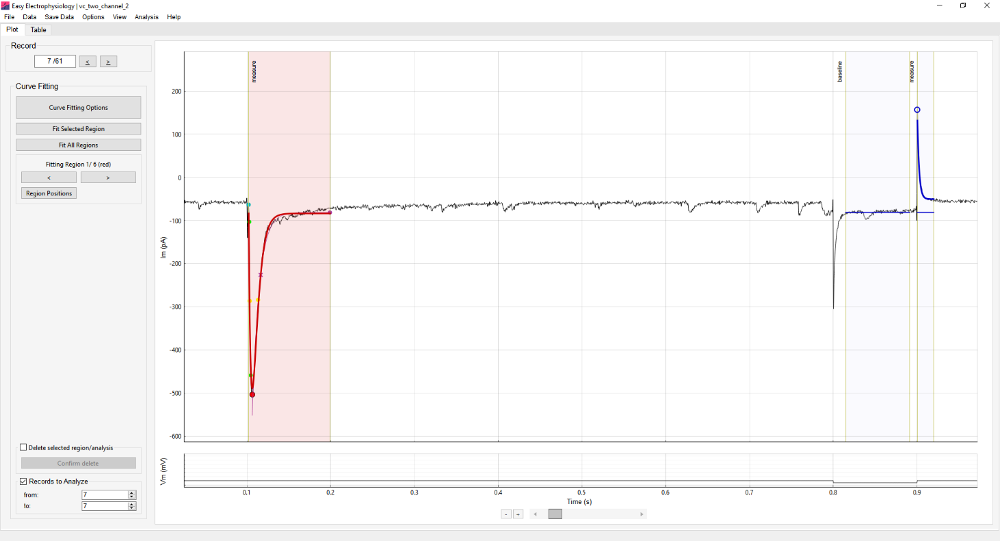
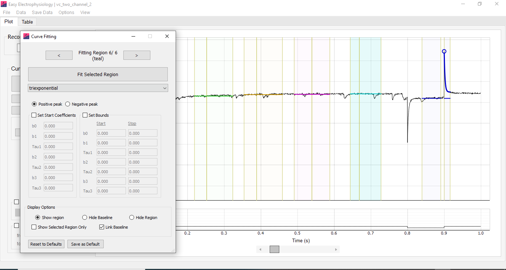

*Curve Fitting* is used for calculating summary statistics or fitting functions to the data (see *Functions to Fit* and *Appendix I* for details of available analyses). The best-fit curve is plotted on the graph and coefficients displayed in the analysis results table. Up to six different fits can be applied simultaneously -- this is useful for recording protocols requiring measurement of multiple evoked events (e.g. paired-pulse recordings with a seal-checking voltage step). All curve fitting analysis is conducted on the primary input channel.

Curve fitting analysis fits a curve for every record in the file by default. To select specific records to analyze set the [Records to Analyze]{.ui-label} box at the bottom of the *Curve Fitting* analysis panel.

## Curve fitting regions

*Curve Fitting* analysis is conducted within 'curve fitting regions'. These consist of two regions, the 'baseline' region and the 'measure' region. The baseline is calculated as the average of all datapoints within the baseline region. The measured region defines the section of data to fit.

Each of the six available regions has a designated color (red, blue, green, orange, pink and teal). Switching between regions is achieved using the left and right buttons on the *Curve Fitting* analysis panel, and *Curve Fitting Options* window. Only the currently selected region can be moved.

Switching to a curve fitting region which is not yet shown will initialize the region. To remove a region and delete all associated analysis, use the [Delete selected region / analysis]{.ui-label} box on the analysis panel.

*Curve Fitting Options*

Options for conducting curve fitting analysis are accessed by clicking the [Curve Fitting Options]{.ui-label} button on the analysis panel. The following view options for the curve fitting regions are available:

-   [Show region]{.ui-label} -- show both the baseline and measure region.

-   [Hide baseline]{.ui-label} -- show the measure region only.

-   [Hide region]{.ui-label} -- hide both the baseline and measure region.

-   [Show selected region only]{.ui-label} -- Hide all regions except the currently selected region.

-   [Link Baseline]{.ui-label} -- By default the baseline and measure regions are linked i.e. moving the baseline region will move the measure region and vice-versa. This option switches between linking and unlinking the baseline and measure regions so they can be moved separately.

{width="6.644490376202975in" height="3.6041666666666665in"}

## Functions to fit

Summary statistics or functions to fit to the data within the measure region can be selected, along with starting and boundary coefficients, on the *Curve Fitting Options* window. Following analysis, the baseline, peak, amplitude (peak minus baseline) and coefficients of the best-fit curve are shown in the [Table]{.ui-label} tab table.

The mathematical formulas for all functions can be found in *Appendix I* of this documentation, and their implementation at our GitHub. Please see below for a full list of parameters and functions:

-   *Minimum / maximum:* Finds the minimum or maximum (depending on selection) within the measured region.

-   *Mean / Median:* Finds the mean / median (depending on selection) of the measured region. The amplitude shown in the results table represents the difference between this average and the baseline.

-   *Area Under Curve (AUC)*: Calculates the area under the curve of the measured region, with respect to the baseline.

-   *Max Slope:* Finds the maximum slope within the measured region, calculated as a regression over n samples. Options are provided for selecting slope direction, the number of samples to calculate the regression over, and applying smoothing prior to calculation.

-   *Monoexponential, biexponential (decay) and triexponential:* Fit an exponential curve with one, two or three terms to the data within the measure region.

-   *Biexponential (event).* Fit a biexponential curve in the form used for event-detection (with rise and decay coefficients). This will also calculate event kinetics (rise-time, half-width, decay). Event analysis options can be accessed with the [Event Kinetics Options]{.ui-label} button on the *biexponential (event)* panel. These include:

    -   *Average peak (ms)* -- the time period to average the event peak (see the *Average peak (ms)* section in *Events* for detail).

    -   *Baseline search settings* -- [Auto.]{.ui-label} will automatically detect the foot of the event and use this as baseline. Alternatively, [Use Baseline]{.ui-label} can be selected which will calculate the baseline as the first sample in the data that crosses the baseline in the direction opposite to the peak (e.g. if the peak is negative it will look for the first positive crossing of the baseline).

    -   *Baseline search period (ms)* -- period to search for the baseline.

    -   *Average baseline (ms)* -- period over which to average the data preceding the baseline).

Note that these configurations are separate from those in *Events* analysis (*Events -- Template Matching*, *Events -- Thresholding*). This means that changing these settings will not affect other event analyses. This is distinct from the events settings accessed through [Options]{.ui-label} › [Events Analysis]{.ui-label} › [Misc. Options]{.ui-label}, which are shared between all Events analysis.

## Curve fitting algorithm

Least-squares fitting of exponential functions uses the Trust Region Reflective algorithm as implemented in the SciPy scientific analysis package (`optimize.least_squares`).

The starting coefficients of exponential fits are estimated from the data (see *Appendix I*). The only default bounds on the coefficients is that exponential time constants (`tau`) must be positive. For biexponential event fitting the default starting coefficients are 0.5 ms and 5 ms (Jonas et al, 1993). These default coefficients are always used for *biexponential (event)* Curve Fitting analysis and are distinct from those in the *Events Analysis -- Misc. Options* menu (which are for event template generation only).

For all functions, default starting coefficients and bounds can overridden in the *Curve Fitting Options* window.

## [Region Positions]{.ui-label}

The *Region Positions* window (on the *Curve Fitting* left-hand panel) provides the option to set the curve fitting region positions numerically. Further, the position of regions may be saved so they are maintained across Easy Electrophysiology sessions. Note that if the saved times of a region do not exist in a new recording, the bounds will bunch at the recording edge. Region positions can be reset to factory defaults by clicking [Options]{.ui-label} › [Reset Options to Factory Defaults]{.ui-label} › [Curve Fitting Positions]{.ui-label}.
