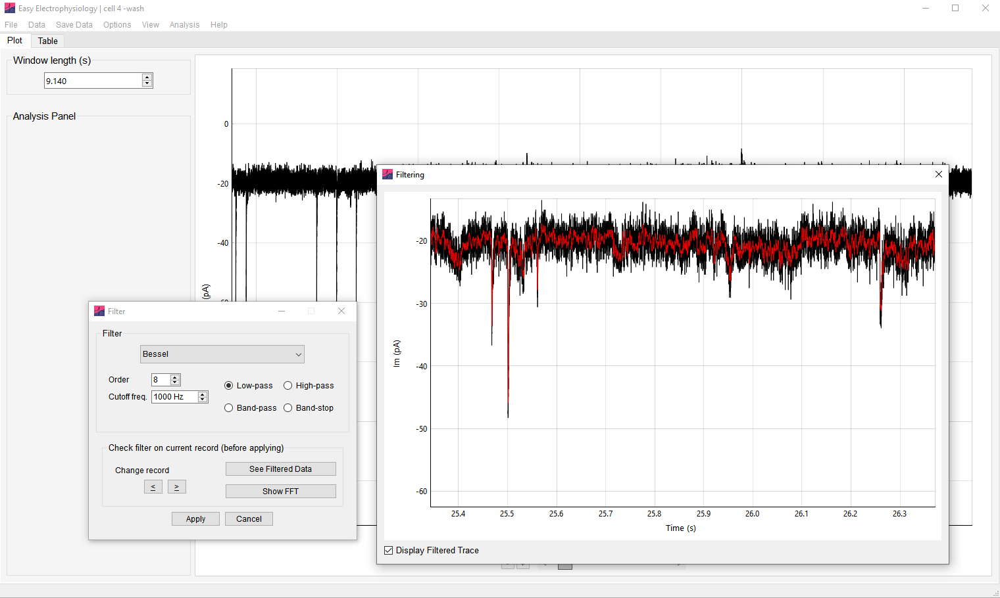
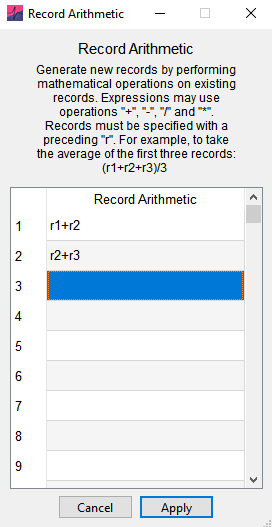
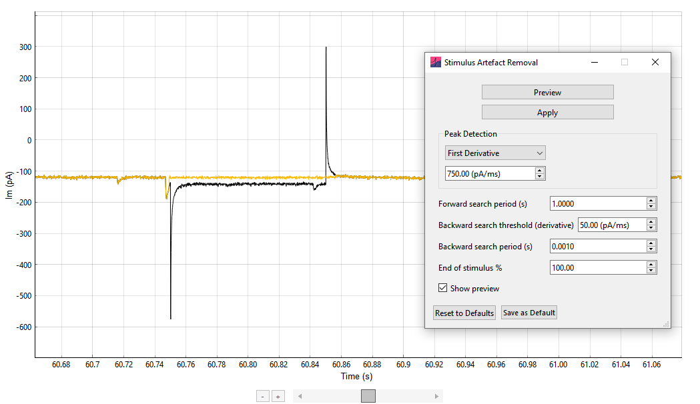

*Data Tools* provides methods for processing electrophysiologic recordings including filtering, resampling, detrending and record averaging.

*Data Tools* can be combined (e.g. interpolate followed by detrend) and run before carrying out analyses. When *Batch Mode* is off, running these methods will clear previous analysis from the graph and results table. When *Batch Mode* is on, running these methods will clear previous analysis from the graph but not from the results table (and running a new analysis will add new table columns rather than overwrite the previous results).

Interpolation and filtering methods utilize SciPy (https://www.scipy.org/) package routines.

## Upsample

Data upsampling increases the resolution of the data by interpolating between samples. The following methods of upsampling are available:

-   *Nearest Neighbor* -- the simplest method of interpolation, in which the interpolants are chosen as the nearest datapoint.

-   *Linear Interpolation* -- a coarse interpolation method in which the interpolants are chosen to lie on a straight line between adjacent datapoints.

-   *Cubic Spline Interpolation* -- a sophisticated interpolation technique in which interpolants are chosen to lie on 3^rd^-order piecewise polynomials between adjacent data points. The polynomial coefficients are set to ensure the interpolated function is continuous at the first and second derivative.

For most purposes cubic spline interpolation is optimal as it produces the smoothest interpolation.

## Downsample

Downsampling reduces the data resolution by discarding every nth sample (up to a factor of 12). Prior to downsampling, the primary channel data is low-pass filtered to the Nyquist frequency of the downsampled data. For two-channel data, both the primary and secondary channel are downsampled, but only the primary channel is filtered before downsampling. This is because it is assumed the secondary channel will contain Im / Vm step protocols. Options for choosing the low-pass filter are provided (default 8^th^ order Bessel).

## Filter

Options for low-pass, high-pass, bandpass and bandstop modes with Bessel and Butterworth filters are provided (Fig. 27).

Zero-phase shift filtering is achieved by passing the data forwards and backwards through a linear digital filter. This process doubles the effective order of the filter, and this is accounted for in the 'Filter' options menu. For example, if an 8^th^ order Bessel is specified, a 4^th^ order filter is designed and the data passed through twice for an effective filter order of 8.

Convenient interfaces are provided for checking the results of filtering before applying to the data. The 'See Filtered Data' button will display the currently selected trace overlaid with the filtered trace in red. 'Show FFT' will show the Fourier-transformed data, with the power-spectrum of the filter data overload in red. Finally, clicking 'Apply' will filter all records in the file.

{width="6.268055555555556in" height="3.752083333333333in"}

## Detrend

Linear and non-linear drifts can be removed from electrophysiological timeseries by detrending. This is particularly useful for long recordings (e.g. sEPSCs) that show some baseline variability.

An nth order polynomial (up to 20^th^ order) is first fit to and then subtracted from the data (see *Appendix I*). In the *Detrend* analysis window, the type of detrending and polynomial order can be accessed through the drop-down menu and input box respectively. Note that the mean is added back to the data after detrending (to remove the mean, see *Remove Baseline*).

Clicking 'View Fit' will display the currently selected record overlaid with the fit polynomial in red. Use the 'View Detrended Trace' button to view the currently selected record after detrending (without applying to the data).

Finally, clicking 'Apply to All Records' will detrend all records in the dataset. A polynomial of the order specified will be fit and subtracted (with the mean added back) for every record iteratively. Only the primary data channel will be detrended.

## Remove Baseline

Removing the baseline is accomplished by subtracting a baseline value from the data. The baseline is calculated as the average within a specified time window (indicated by the period within the boundary region that appears on screen).

Clicking 'Apply' will apply baseline removal for every record in the file. For each record, the baseline is calculated and subtracted separately.

If your file has two channels (i.e. Vm and Im) clicking the checkbox option will also calculate and remove the baseline from the second data channel (across the time window specified on the primary data channel).

## Average Records

Averaging across records is useful for reducing noise in repeated-stimulation protocols. If set to 'Average All Records', every record in the file will be averaged into one record.

Alternatively, specific records can be selected for averaging by choosing the 'Average specific records' option from the dropdown menu. A single-column table will be displayed. The rows of the table can be used to group records for averaging. For example, in a 10-record file 1,2,3 could be entered to the first row, and 4,5,6 into the second. Clicking 'Apply' would generate with 2 records (record 1 - average of 1,2,3; record 2 - average of 4,5,6, with records 7,8,9,10 discarded).

## Record Arithmetic

Record arithmetic ('Data' \> 'Record Arithmetic') provides the option to perform arithmetic operations pointwise across records e.g. add two records together, sample-by-sample.

Record Arithmetic can be performed by a flexible interface that takes text input. Records are referred to with the "r" prefix, and permitted mathematical operations are the addition ("+"), subtraction ("-"), multiplication ("\*") and division ("/"), and brackets. For example, to add the first and second record: "r1+r2". To calculate the average of the 2^nd^, 3^rd^ and 4^th^ records: "(r2+r3+r4)/3".

Multiple record arithmetic expressions over sets of records can be performed by inputting an expression on each row of the input table. For example, Fig. 28 will result in a 2-record file, with the first record being the sum of the first and second record, and the second record being the sum of the second and third record.

{width="2.2805555555555554in" height="4.417361111111111in"}

## Stimulus Artefact Removal

Electrophysiological recordings are often contaminated by artefacts from electrical stimuli used to elicit the membrane responses during experimental protocols (Fig. 29). *Stimulus Artefact Removal* can automatically remove such stimulus artefacts from the data.

The data with stimulus artefacts removed can be displayed by clicking the 'Preview' button, which will preview the trace with stimulus-artefact removed in orange. Clicking 'Apply' will apply the stimulus artefact removal to the data, closing the Stimulus Artefact window.

The default parameters typically work out of the box on most datasets, however the details of the algorithm are explored below in case the default parameters need to be adjusted.

{width="6.814987970253719in" height="3.926525590551181in"}

*The stimulus artefact removal algorithm*

The first step is to detect the peaks (positive or negative) of the stimulus artefacts. The method used for detection is by default the first derivative. The first derivative is usually optimal because stimulus artefacts typically have a much faster rise times than physiological responses. Therefore, setting a high derivative threshold can selectively pick out stimulus artefact events. However, an absolute threshold is also available.

Next, the period from the stimulus artefact peak to the end of the artefact in the 'forward' direction (i.e. moving forward in time) is detected. The length of the window that is searched (from the peak to the end of the artifact) is set by *forward search period (s)*.

The value taken as the end of the stimulus artefact is determined by the *End of stimulus %* parameter. The sets the data value at which the stimulus artifact is determined to have reached baseline. This is detected by the crossing of a threshold which takes the value of the baseline signal plus some percentage of the noise of the signal (here, the noise is measured as the median difference between consecutive samples). The *End of stimulus %* sets this percentage. For example, if *End of stimulus %* is set to 200%, a datapoint will be considered returned to baseline once it is within twice the noise level.

Finally, the point where the stimulus artefact started is determined. The parameter b*ackward search period (s)* defines the size of the window, starting at the peak, which is searched for the stimulus artefact start. Because stimulus artefacts are characterized by a fast rise time, a derivative threshold is again used. The first sample that crosses the *backward search threshold (derivative)* is taken at the start of the stimulus artefact.

All datapoints within the region determined to contain the stimulus artefact are replaced with samples randomly drawn from a Gaussian distribution with mean and variance estimated from the data.

## Reshape Records

Selecting *'Concatenate all records into a single record'* will combine multiple records into one long record. Note that where recorded time intervals between records are not continuous, because they reflect gaps in the recording schedule (e.g. Record 1, 0 -- 2 s, Record 2, 3 -- 5 s), they will be made continuous (e.g. record 1 and record 2 would be concatenated into a single record between time points 0 -- 4 s).

Alternatively, a single-record dataset can be split into multiple records if the number of records is known by selecting *'Expand data from a single record to multiple records'*. This can be useful as in some instances .ABF files exported from other software (e.g. Igor, WinWCP) are concatenated into a single-record file, or to increase performance for long single-record files.

The option is provided to normalize time when reshaping records (so every record has the same time period, see *Normalize Time).*

If the number of samples does not divide without remainder into the number of records, a warning will show and the remainder samples will be removed from the end of the single record before reshaping.

Long single record files (containing millions of datapoints) can slow down the software due to the overhead associated with displaying the data on the graph. A simple workaround is to reshape the single-record into multiple, smaller records. The only difference this will make is for *Events* analysis, inter-event intervals (used for Frequency cumulative probability and histogram plots) are not calculated across records. As such, the number of inter-event intervals will be reduced by N, where N is the number of records. In large files with many hundreds or thousands of events this will make no difference to the results, in particular considering inter-event interval size is randomly distributed through the recording.

## Normalize Time

The time in electrophysiological data may be recorded in two ways. If 'normalized', the times of each record are the absolute record length (e.g. for 2 second recordings, record 1: 0 -- 2 s, record 2: 0 -- 2 s). Alternatively time may be recorded relative to the start of recording, increasing cumulatively (e.g. record 1: 0 -- 2 s, record 2: 2 -- 4 s). *Normalize Time* applies the time vector from the first record for every record in the recording. Note that this assumes all records in the dataset are the same length.

## Cut Trace Length

This give the option to set new record start / finish times (e.g. cut a trace that is 0 -- 2 s long down to the time period 0.5 -- 1 s). An offset will always be subtracted to ensure the first record starts at time = 0.

Clicking 'Apply' will change the record length for every record in the file. Options are provided for cumulatively increasing record times after cutting trace length (e.g. record 1: 0 -- 0.5 s, record 2: 0.5 -- 1 s) or normalizing time instead (see *Normalize Time*).

## Reset to Raw Data

If you are unhappy with the results, data can be reset to raw data (as loaded from file).
