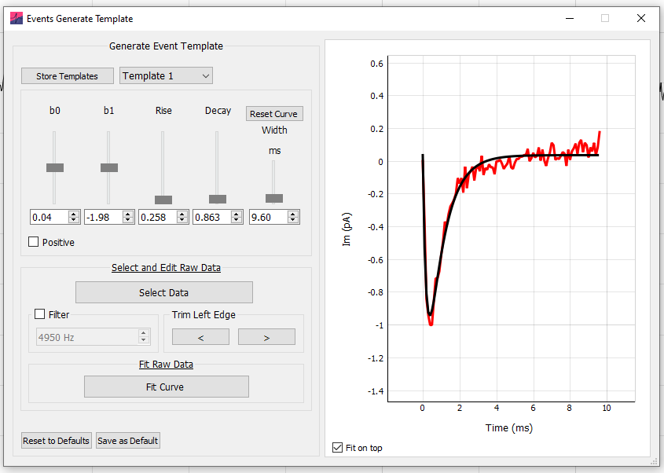
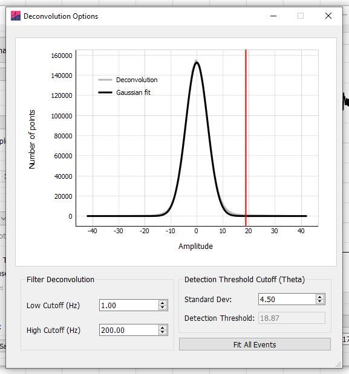
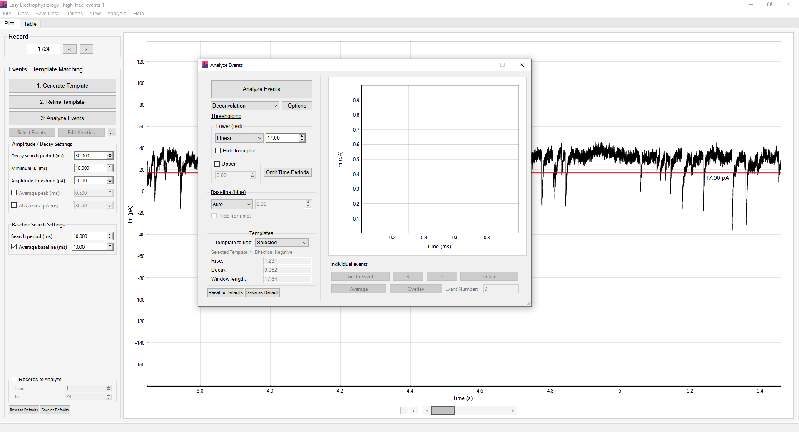
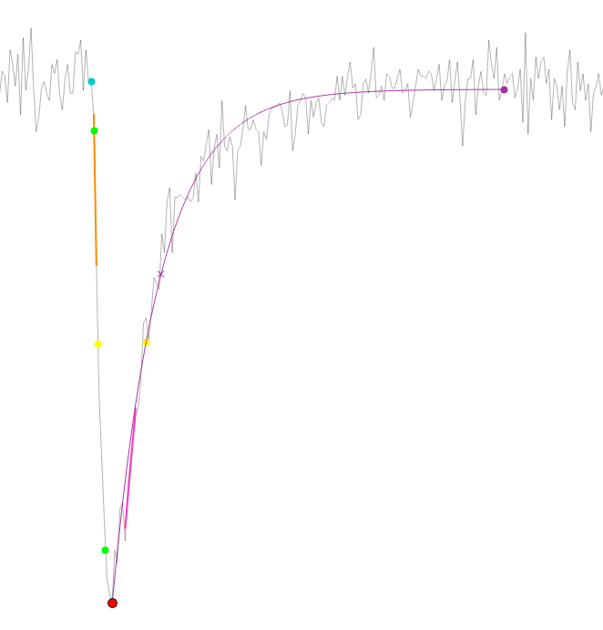
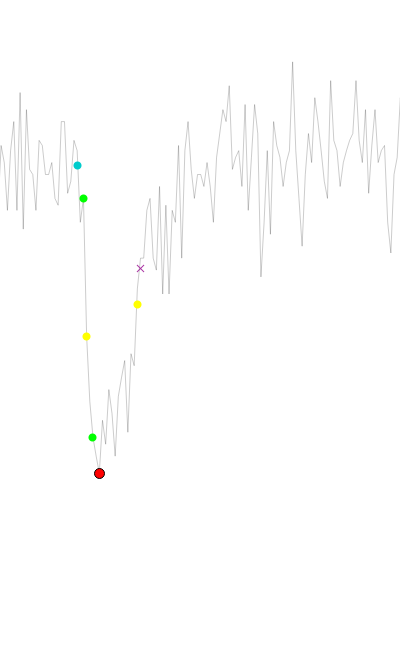
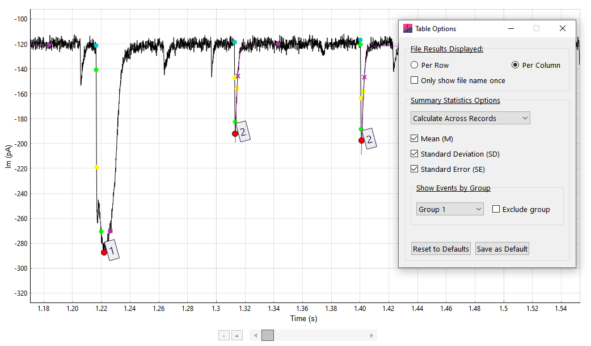

## Overview

Easy Electrophysiology provides two options for events analysis, *Events -- Template Matching* and *Events -- Thresholding*. For simplicity, all relevant options, graphs and results tables are shared between *Events* detection methods (e.g. running an events analysis with *Template Matching* will overwrite a previous analysis with *Thresholding*).

## Event detection methods -- background

*Events -- Template Matching*

Template matching relies on the generation of a 'template' event in the form of a biexponential function (Jonas et al., 1993 see also Guzman et al., 2014). The template is generated by fitting the biexponential function to an exemplar event from the recorded data (the key parameters to fit are the 'rise' and 'decay' coefficients; *Appendix I*). This ensures the biexponential rise, decay, and fitting window are tailored to the shape of the post-synaptic events to be detected. This initial event template can be further refined by fitting to the average of all detected events (see *Refine Template* for details).

The main aim of all event detection algorithms is to calculate the measure of the similarity between the data and the template at every sample in the data. Easy Electrophysiology implements the correlation method (Jonas et al., 1993), the detection criterion method (Clements and Bekkers, 1997) and the deconvolution method (Javier Pernía-Andrade et al., 2012). In the correlation approach the template is correlated to the data at each timepoint using a sliding window. A correlation cutoff value is then specified (default r = 0.40) and a contiguous area above the correlation cutoff is considered an event region. In the Detection Criteria approach a 'detection criterion' (default = 4) rather than correlation is calculated. This scales the event amplitude to the noise and is closely related to the signal-to-noise ratio of the event. Both correlation and detection criterion are implemented using sliding window implementation of Clements and Bekkers, (1997) for performance. The correlation and detection criterion generally perform well but have poor temporal resolution and typically fail to detect high-frequency, closely spaced events. In contrast, the deconvolution method can reliably detect closely spaced events. In the deconvolution method, deconvolution of template and data is performed in the Fourier domain and bandpass filtered with a Gaussian window. The default cutoff value (specified as standard deviation of the amplitude

distribution) is 3.5, with default cutoff for the bandpass filter 0.1 -- 200 Hz. These often need to be adjusted to the dataset (see *Refine Template).*

These approaches all yield a 'similarity measure' indicating the similarity between the template and data and each sample point. This is then thresholded with the respective cutoff value, and any contiguous event that exceeds this threshold is considered a detected event. Interactive plots of the biexponential event fit and similarity measure across the entire dataset to help assess the fit (see *Refine Template* for details).

*Events -- Thresholding*

Events thresholding is a simpler method of event detection in which any datapoint that crosses a set threshold is considered an event. This method is less precise than the template matching method (e.g. a noise spike over threshold would be considered an event) but is less computationally demanding.

## Events -- template matching

## [Generate Template]{.ui-label}

The first step in template matching is to generate the template event. Click [1. Generate Template]{.ui-label} on the [Events -- Template Matching]{.ui-label} analysis panel for template generation. A biexponential event template is shown on the graph with sliders and input boxes for manual adjustment of template coefficients. It is possible to increase the coefficients outside the slider range by typing the values directly into the input boxes. The coefficients that define the template shape are:

-   *b0* and *b1*-- the offset (mean) and slope parameter that determines the direction (positive or negative) and event amplitude, respectively. These coefficients are left free during event detection and so are not important for template generation.

-   *Rise* -- the event rise-time (defaults 0.5 ms from Jonas et al., 1993)

-   *Decay* -- the event decay-time (default of 5 ms from Jonas et al., 1993)

-   *Width* -- The width (in ms) of the event template.

The best way to generate a template event is to fit the biexponential function to a recorded event from the dataset. An event from the data can be selected by clicking [Select Data]{.ui-label} and drawing around an event to fit. When selecting an event it is helpful to change the graph zoom settings to [Two Button (Pan Left, Zoom Right)]{.ui-label} by right-clicking on the plot and choosing [Mouse Mode]{.ui-label} › [Two Button (Pan Left, Zoom Right)]{.ui-label}. This allows the left button to zoom while selecting data with the right button.

*Fitting the Event*

Once an event from the data is selected it will appear on the graph (red). The start of the event to fit can be shifted with the buttons in the [Trim Left Edge]{.ui-label} box -- the start point is critical for optimal fitting. The event from the data can also be filtered prior to fitting (8^th^ order Bessel).

Clicking [Fit Curve]{.ui-label} will fit the biexponential function to the event. This will change the coefficients in the top panel. These coefficients are now saved until Easy Electrophysiology is closed. To save these for the next session, click the [Save]{.ui-label} button (see *Saving and Resetting Option Defaults* for details).

*Storing Templates for Later Use*

Templates may be stored for later use and loaded by clicking the [Store Template]{.ui-label} button in the top left of the Generate Template menu. This will bring up another window allowing the current template to be saved with an identifying name. To save the current template, first enter the name in the [Save Template Name]{.ui-label} text box and click [Save Template]{.ui-label}. To load a template as the current template, click on the template name (the row will become highlighted) and press [Load Template]{.ui-label}. Note this will overwrite the coefficients in the current template. To delete a stored template, click on the template name and press [Delete Selected Template]{.ui-label}.

*Generation of Multiple Templates for Simultaneous Analysis*

Use of up to three templates can be used simultaneously for event detection (See *Template to Use* for how to run analysis with multiple templates). The three templates can be accessed using the drop-down menu ([Template 1 -- 3]{.ui-label}) in the Generate Template menu. The displayed template is referred to as the currently selected template and will be used in analysis when this option is selected in *Analyze Events*. When fitting a template to the data or loaded from [Stored Templates]{.ui-label}, the coefficients will be stored in the currently selected template (e.g. [Template 2]{.ui-label}). The *Average Event* will always be fit using the currently selected template.

## [Refine Template]{.ui-label}

The *Refine Template* window is used for a) assessing the fit of an event template and b) generating a refined template by fitting to the average of all events detected with the initial template.

Clicking [Fit All Events]{.ui-label} detects events using the currently selected template. Detected events are displayed on the graph with a filled yellow circle at the peak and their baseline in blue. The average of all detected event is plot on the graph in red. Options to align by [Rise half-width (half-way up the event rise)]{.ui-label}, [Peak]{.ui-label}, and [Baseline]{.ui-label} are provided in the [Alignment Method]{.ui-label} drop-down box. The process of fitting to the average event is identical to fitting in *Generate Template*.

The dropdown menu at the top of the window can be used to select the event detection method. If [Correlation]{.ui-label} or [Detection Cutoff]{.ui-label} is chosen, the desired cutoff value can be entered in the box next to the drop-down menu. Alternatively, if [Deconvolution]{.ui-label} is selected, the cutoff can be adjusted by clicking [Options]{.ui-label} (detailed below).

*Assessing Event Detection*

Clicking the [Show (detection method name)]{.ui-label} button will show the detection measure overlaid on the plot. The cutoff value is shown as a horizontal line. This option is very useful for assisting in choosing a cutoff value, as its position in relation to the detected peaks can be observed. The detection measure units are scaled to fit to the plot for visualization purposes and cannot be interpreted directly.

![Refine Template analysis. The filtered deconvolution is displayed in orange with the current cutoff as a horizontal line. The average detected event is shown in red and can be fitted using [Fit Curve]{.ui-label}.](images/media/image10.PNG){width="6.81179571303587in" height="3.690018591426072in"}

For correlation and detection criterion methods, the [Show Window Fit]{.ui-label} button will display the best-fit biexponential overlaid on the data of the main plot. When zoomed in, scrolling will move the biexponential along the data, allowing inspection of the fit at every timepoint. For this, it is convenient to use [Two Button (Pan Left, Zoom Right)]{.ui-label} by right-clicking on the plot and choosing [Mouse Mode]{.ui-label} › [Two Button (Pan Left, Zoom Right)]{.ui-label}.

*Deconvolution Options*

In [Deconvolution Options]{.ui-label}, a cutoff value can be specified in the [Standard Dev]{.ui-label} box. This will select the standard deviation of a distribution created by the amplitude of the cutoff measure at each sample. For example, choosing 3.5 will select events that have a detection measure only \> 3.5 standard deviations larger than the mean (default value = 3.5).

Additionally, the cutoff measure undergoes bandpass filtering which can affect its shape. Default values are 1 for the [Low Cutoff (Hz)]{.ui-label} and 200 for [High Cutoff (Hz)]{.ui-label}. Changing the high cutoff will influence the height and sharpness of the detection measure peaks and is useful to adjust when selecting optimal values for your data. The best way to choose values is to show the deconvolution on the plot (click [Show Deconvolution]{.ui-label}) and visually inspect how it changes when the filter settings are adjusted and analysis re-run.

## [Events Analysis Options]{.ui-label}

Due to the large number of possible configurations for running event analysis, the options are split into three categories:

[Event Detection Window Options]{.ui-label}: These options appear in the analysis windows when running *Events Template Refine, Events Template Analyze* and *Events Threshold Analyze* analysis. These options are related to the detection of events.

[Event Fitting Analysis Panel Options]{.ui-label}: These options appear on the *Events -- Template Matching* and *Events -- Thresholding* analysis panels. These options are related to analysis of event parameters (e.g. amplitude threshold, peak smoothing).

[Events Options]{.ui-label}: These options cover general event analysis settings for *Events -- Template Matching*, *Events -- Thresholding*, and all *Curve Fitting* biexponential event analysis. These options are found at [Options]{.ui-label} › [Events Analysis -- Misc. Options]{.ui-label}.

The settings of each of these option categories can be saved and reset separately (see *Saving and Resetting Default Options* for details).

## [Event Detection Window Options]{.ui-label}

{width="6.268055555555556in" height="3.397222222222222in"}

*Lower Threshold*

This is the minimum value that an event must pass to be considered within threshold, specified in pA. It is dependent on the direction of events (e.g. for a threshold of 5 pA, positive events must contain a datapoint \> 5 pA, negative events must contain a datapoint \< 5 pA. The *lower threshold* is displayed on the graph in red. Using the dropdown menu, it can be specified as:

-   [Linear]{.ui-label} -- A straight horizontal line across the trace. This can be moved up and down with the mouse, or the desired threshold value typed into the input box.

-   [Curve]{.ui-label} -- A polynomial is fit to the data and used as the threshold. This can be moved up or down by typing the desired offset into the input box. The order of polynomial fit can be changed by clicking [Options]{.ui-label} › [Events Analysis -- Misc. Options]{.ui-label} › [Dynamic Curve polynomial order]{.ui-label} (under [Other Options]{.ui-label}). Note fitting of higher-order polynomials slow performance.

-   [Drawn]{.ui-label} -- Setting the drop-down menu to [Draw]{.ui-label} then clicking the [Draw Threshold]{.ui-label} button will enter threshold drawing mode. The cursor will change to a pointed hand; clicking the graph will begin drawing a baseline. The first click will draw a horizontal line from the left edge of the record to the cursor. Subsequent clicks will draw a straight line from the previous point to the cursor. To finish drawing the threshold, click the right edge of the graph past the final plot datapoint. This mode is particularly useful when there are large, sudden changes in the data's baseline.

Note that if a new file is loaded which is longer than the currently drawn threshold, the threshold will be extended as a straight line to the new end timepoint.

-   [RMS]{.ui-label} -- The root mean squared error (RMS) of the data (multiplied by some scalar *n)* can also be used as a minimum threshold. The minimum threshold is the baseline minus the *n* x RMS (for negative events, baseline plus *n* x RMS for positive events) and is shown on the plot in red. The baseline that the RMS is added to is determined by the choice of event baseline (if [Auto.]{.ui-label} is selected, the mean of the data will be used, separately for each record.).

When selecting [RMS]{.ui-label} from the drop-down menu, clicking [Settings]{.ui-label} will open a window allowing choice of settings for calculating the RMS. The multiple *n* to scale the RMS to (e.g. 2x RMS) can be typed into the input box. If [All Data (Per Record)]{.ui-label} is selected, the RMS will be calculated separately for each record, using the mean of the record as calculation baseline. Alternatively, selecting [Within Selected Region]{.ui-label} will allow calculation of the RMS within a movable region on the graph. Selecting the option [Baseline used: mean]{.ui-label} will use the mean of the data within this region as the calculation baseline for the RMS. Otherwise, if [Baseline used: selected baseline]{.ui-label} then the currently selected baseline will be used as the calculation baseline during RMS calculation. In [Baseline used: selected baseline]{.ui-label} mode, for [Linear]{.ui-label}, [Curve]{.ui-label}, and [Drawn]{.ui-label} baselines, the RMS is calculated as the root mean square error between the baseline and data. For [Auto.]{.ui-label}, the calculation baseline is the mean of the entire record (not the data within the bounds).

*Baseline Options (Analyze windows only)*

The event baseline can detect automatically ([Auto.]{.ui-label}) or used as the first sample that the data crosses a pre-defined baseline value. The baseline datapoint acts as both the baseline Im value and the event foot (i.e. the timepoint at which the event starts).

For automatic detection, the baseline is first estimated per-event (see Legacy options). Next, the method of Jonas et al., (1993) (the intersection between the baseline and a straight line drawn through the 20-80 rise time) is used to shift the x-axis position of the baseline to the point of the event foot. Together, these methods result in robust simultaneous estimation of the event baseline and foot.

This baseline value can also be specified in a similar way as *lower threshold* (i.e. [Linear]{.ui-label}, [Curve]{.ui-label}, or [Drawn]{.ui-label}). This will search the *baseline search region* for the first datapoint that has crossed this baseline threshold and set it as the baseline. If no datapoint crosses the baseline threshold within the search region, the closest value to the threshold is used.

*Upper Threshold*

The *upper threshold* is defined as the maximum value an event can pass before it is excluded from analysis (e.g. for a 100 pA threshold, any positive event \> 100 pA or negative event \< 100 pA will be excluded). This option can be specified by typing the absolute value in the input box. This is particularly useful to excluding large noise spikes e.g. stimulus artefacts.

*Omit Time Periods*

Omitting time periods from analysis can be useful for event recordings with interleaved stimulation. The [Omit Time Period]{.ui-label} button opens a table for inputting time periods to omit from analysis. Add the start time of the period to exclude in the first column and the end time in the second column. Multiple time periods to exclude can be input, one on each row.

When set to [absolute]{.ui-label}, the events are excluded based on the absolute value of the omit times. When set to [relative]{.ui-label}, the events are excluded based on the omit times relative to the start of the record on which the event occurs.

*Template to Use (Events -- Template only)*

Event detection may be run with up to three different templates simultaneously. The [Templates to Use]{.ui-label} specifies the templates to use for the analysis ([Selected]{.ui-label}, [Template 1 and 2]{.ui-label}, or [Template 1, 2 and 3]{.ui-label}). See *Generation of Multiple Templates for Simultaneous Analysis* for details on generating the three templates. The *Average Event* and manually selected events are always fit using the currently selected template.

If set to [Selected]{.ui-label}, the currently selected template (in [Generate Template]{.ui-label}) is used. The coefficients of the currently selected template can be seen directly underneath the drop-down menu. Otherwise, templates 1 and 2, or 1, 2 and 3 are used depending on the selected option.

Analysis with multiple templates is run in the same way as a normal analysis. On the plot, the events detected by different templates can be distinguished by the peak color (Template 1: red, Template 2: pale blue, Template 3: pale orange). In the results table, the column [Table]{.ui-label} holds the number of the template that was used to detect the event. To set the behavior in the case that the same event is detected by two different templates, see *Multi-template event assignment.*

## Event kinetics overview

**A** *Baseline* *--* The event baseline (filled blue circle) acts as both the baseline value and timepoint considered the start of the event. The baseline calculation method is set in *Baseline Options (Analyze windows only)* and modified with *Baseline -- Search period (ms)* and *Average Baseline (ms).*

**\
B & F** *-- Max Rise / Decay* *Slope --* The maximum slope on the rise or decay, calculated as a linear regression over n points (specified in *Calculate* *Max Rise / Decay Slope*).

**C** *Half-width* *--* The half-width is calculated as the full-width at half-maximum (FWHM). This is the time between two half-amplitude samples (on the rise and decay; displayed on the plot with filled yellow circles). The nearest samples to the 'true' half-amplitude are used to calculate the FWHM; as such *Interpolate to 200 kHz* can greatly improve accuracy. If a monoexponential curve is fit to the decay, or biexponential to the event, this will be used to find the decay, and rise and decay respectively for half-width calculation.

**D** *Rise-time* *--* The rise time is measured as the time between two timepoints (filled green circles), specified as the percentage of the event amplitude (peak minus baseline). These 'percentage cut-offs' can be changed using the *Rise-time Cutoffs* setting (10-90 rise-time is default, *shown*).

**E** *Peak --* The peak of the event can be smoothed using *Average Peak (ms).*

**G** *Decay time* *--* By default, is the time between the event peak and the first sample at which the event has decayed to specified percentage of the event amplitude (default 37%). The sample used is displayed on the graph with a purple cross. Alternatively, this can be set in [Options]{.ui-label} › [Events]{.ui-label} to a second method, that uses two points similar to *Rise-time.* If a monoexponential or biexponential curve is fit to the data, this will be used to find the decay time and half-width.

The percentages are set with the *Decay time* setting. The period to search for the *Decay time* values can be set using *Decay Search Period (ms).*

**H** *Decay Fit* *--* A monoexponential fit to the decay is displayed with a purple line. The tau of this fit is reported in the Events results table (if this fit is good, this result should closely match the *Decay times* (first method) when set to 37%).

**I** *Decay endpoint* *--* If a monoexponential decay is fit, the automatically-detected end-of-event is used as the fit endpoint (shown with a filled purple circle). See *Decay Search Period (ms)* for details.

## [Event Fitting Analysis Panel Options]{.ui-label}

*Peak Direction (Events Threshold only)*

Direction of the events to detect.

*Minimum IEI (ms)*

The minimum inter-event interval (IEI) between event peaks in milliseconds. For example, if set to 1000 ms, detected events will be at least 1 second apart. Detected events that are closer than the local minimum period (i.e. 1 s in our example) will be excluded, with smallest events excluded first.

*Decay Search Period (ms)*

![Event Detection Results. Detected event peaks are marked with filled red circles. The lower threshold is shown in red and the baseline in blue. Event baselines and decay endpoints can be adjusted in [Edit Kinetics]{.ui-label} mode.](images/media/image14.PNG){width="6.884027777777778in" height="3.73125in"}

When fitting a monoexponential function to the event decay, the end of the event is estimated as the closest datapoint to the baseline (using a weighting and smoothing algorithm used to account for noise and complex waveforms). This end-of-event point is indicated with a closed purple circle on the graph. The monoexponential function is fit between the event peak and the event-of-event datapoint. Here, the *decay search period* indicates the period to search for the event-of-event datapoint.

If a monoexponential curve is not fit to the decay, the *decay search period* defines the search region, starting at the event peak, for the *Decay* times value.

*Amplitude Threshold (pA)*

Sets the minimum amplitude (event peak minus baseline; absolute value) for detected events. Any events with an amplitude smaller than this threshold are excluded.

*Average Peak (ms)*

Period to smooth around the event peak. The intuitive method of peak averaging is to simply average around the peak detected from unsmoothed data. However, this method often detects the peak at off-center noise spikes (i.e. not centered on the natural peak of the event).

In Easy Electrophysiology, the event is first detected without smoothing. Then, the event is smoothed with a window of size specified with this *average peak* option. Finally, the new peak is determined from the smoothed data in a small region around the previously detected peak (±3 \* *average peak*). This method simultaneously smooths the peak Im value as an average of surrounding points and adjusts the position to reduce noise bias.

*AUC min. (pA ms)*

Area Under Curve (AUC) threshold can be set to exclude putative events with small areas. Note this is the absolute value (as for negative events area is defined as negative area) (e.g. if set to 5, negative events with area -10 pA ms will be included, but -3 pA ms excluded).

*Baseline -- Search Period (ms)*

The time period before the event peak to search for the baseline. When baseline detection method is set to [Auto.]{.ui-label} (in the *Analyze Events* window), this specifies the search period for automated baseline detection. For all other baseline options ([Linear]{.ui-label}, [Curve]{.ui-label}, [Drawn]{.ui-label}) this is the search period for the first datapoint that crosses the baseline (see *Baseline Options (Analyze windows only)*).

*Average Baseline (ms)*

The period over which to average the event baseline. First, the event baseline is detected with the selected method (*Auto., linear, curve, drawn*). Then, the baseline value is set to the average of a window before the baseline. *Average baseline* sets the size of this averaging window.

## [Events Options Window]{.ui-label}

Additional event detection and analysis options can be found by clicking [Options]{.ui-label} › [Events]{.ui-label}. These options are shared between *Events* -- *Template Matching, Events -- Thresholding*, *Average Event* and *Curve Fitting* (biexponential event) analysis.

*Decay Endpoint search method*

This option selects the method used to calculate the endpoint of the event (i.e. when the event is considered to have finished). This is the period across which the decay times parameter will be searched, and act at the endpoint for monoexponentially and biexponential fits. A third, older event endpoint detection method is available in *Legacy Options.*

[Entire Search Region]{.ui-label}, the event endpoint will be at the exact time after the peak specified in the *Decay search period (ms)* (e.g. if the decay search period (ms) is 30 ms, and the peak is detected at 100 ms, the decay endpoint will be at timepoint 130 ms). However, if another event occurs before this decay endpoint, the decay endpoint will be moved to one sample prior to the next event baseline.

[First Baseline Cross]{.ui-label}, the first datapoint that crosses the baseline is used as the event endpoint. The data is smoothed slightly (3 samples) to avoid large noise spikes that may occur during the decay period. If no sample in the search period crosses the baseline, the datapoint closest to the baseline is used. Similar to [Entire Search Region]{.ui-label}, if the next events baseline is before the detected decay endpoint, the decay endpoint will be moved.

*Interpolate to 200 kHz*

Interpolate the event to 200 kHz prior to decay-time, rise-time and half-width analysis (linear interpolation). First, the event peak, baseline and event end-point is calculated. Then the event (i.e. the period between the baseline and event end-point) is interpolated before decay, rise and half-width analysis.

*Rise-time Cutoffs*

Specifies the cutoffs for rise-time calculation (by default, the 10-90 rise-time is used).

*Decay time*

These options specify the method used to calculate the decay time, and their exact percentages. By default, the time from peak to a value at some specified % of the amplitude is the decay time. Alternatively, the second method ([between points]{.ui-label}) is calculated similar to the rise time.

*Calculate* *Max Rise / Decay Slope*

The maximum rise and decay for each event will be calculated if this option is on. It is not calculated by default as it may increase analysis time, particularly if the slope is calculated over many samples.

The maximum slope is calculated as a regression over n points. The number of samples to calculate the regression over can be specified separately for the rise and decay. If the number of samples to calculate the regression is larger than the number of samples in the rise / decay, this parameter will not be calculated for the event.

In some cases, noise spikes can bias the calculation of the maximum slope. As such, an option to smooth the rise / decay before calculation of maximum slope is provided.

Finally, it is recommended to select [Always use baseline crossing as max slope search endpoint]{.ui-label}. This ensures that the algorithm will stop searching for the maximum slope close to the point when the decay returns to baseline. Otherwise if this is unchecked and the *Decay endpoint search method* is set to [Entire Search Region]{.ui-label}, the entire *Decay search period (ms)* will be searched for regression, leading to poorer accuracy and increased analysis time.

*Event Curve Fitting*

Event curve fitting provides options for fitting a biexponential function to the entire event ([Biexponential]{.ui-label}), monoexponential function to the decay period ([Monoexponential to Decay]{.ui-label}), or not fitting ([Don't Fit Event]{.ui-label}).

If a biexponential is fit, half-width and decay times will be calculated on the fit. If a monoexponential is fit, the decay part of the half-width and decay times will be calculated from the fit. If [Don't Fit Event]{.ui-label} is selected it is recommended to slightly smooth the decay period for calculation of decay times and half-width to reduce the influence of noise spikes that may occur after the true decay mid-point, as shown in the examples below.

Options are provided to ensure only optimal fits are included in the results. Two measures to assess the fit are provided as a basis to exclude or attempt to improve the fit -- the R^2^ or coefficient of the fit function.

If excluding based on R^2^ or bounds, any event with a fit lower than the R^2^ value or outside of the coefficient bounds will be excluded from the results. Alternatively, it is possible to try and improve the fit by adjusting the first sample of the data the function is fit to.

Both biexponential and monoexponential fitting are extremely sensitive to the position of the event foot and peak, respectively. For monoexponential fits, new-start-points both to the right and left of the peak will be attempted. For biexponential fits, samples only to the right of the baseline will be attempted, as choosing samples further from the natural foot of the event typically worsens biexponential fitting. If improvement is not sufficient such that the fits are within threshold, the event will be excluded.

For biexponential fits, the starting estimate for the coefficients will be taken from the template used to detect the event in *Events Template* analysis. Otherwise, for *Events Thresholding* and *Curve Fitting* analysis the default coefficients specified in *Template Matching -- Initial Coefficients* will be used.

These options can also be useful for excluding erroneously detected events. The most typical cause of poor fits is that the putative event is in fact a noise spike.

*Other Options*

-   [Don't threshold manually selected events]{.ui-label} -- by default, when manually selecting events the *Amplitude Threshold (pA)*, *Omit Start Times*, *Threshold -- Lower*, and *Threshold -- Upper* are applied. If this option is off, these exclusion criteria will not be applied for manually selected events.

-   [Dynamic curve polynomial order]{.ui-label} specifies the order of the polynomial used in *Lower Threshold* and *Baseline* curves. Fitting high-order polynomials will increase computation time.

-   [Multi-template event assignment]{.ui-label} -- If set to [To best fitting template]{.ui-label}, the template with the highest value of the detection measure (see *Events -- Template Matching*) at the start of event estimated from the template is used. If set to [To first template used 1 > 2 > 3]{.ui-label}, the first template that detects the event (in the order 1, 2, 3) will be used.

-   *Template Matching -- Initial Coefficients* specifies the default coefficients for the *Events -- Template Matching* template generation, *Curve Fitting* (biexponential event), and biexponential fitting to events in *Events - Thresholding*.

## Manual selection and rejection of events and kinetics editing

Easy Electrophysiology offers a high degree of flexibility when it comes to manual adjustment of event detection and analysis. Erroneously detected events may be discarded, or undetected events manually selected. Furthermore, the position of event baseline and foot, and endpoint can be easily adjusted.

*Discard and Select Events*

To discard detected events, click twice on the filled circle at the peak of an event. The first click will prime the event for deletion (the circle will turn blue) and the second click will delete the event from analysis. Alternatively, holding [D]{.ui-label} while selecting multiple event peaks by click-and-dragging the mouse on the main plot will delete multiple events at once.

To manually select an event, click the [Manually Select Events]{.ui-label} option on the [Analysis Panel]{.ui-label} (for both *Events -- Template Matching* and *Events -- Thresholding*). The cursor will change to a crosshair and click-and-dragging on the graph will draw a circle. The peak (minimum for negative events, maximum for positive events) in this region will be taken as the new event peak. All current settings (e.g., smoothing, search periods, though see *Don't threshold manually selected events*) apply to manually selected events. However, the fitting method must be the same for every event in an analysis, as such the fit of a manually selected event will always match the analysis used.

*Edit Kinetics*

The position of the event baseline and decay endpoint can be manually adjusted. Clicking [Edit Kinetics]{.ui-label} will enter [Edit Kinetics]{.ui-label} mode, indicated by the cursor changing to a pointing hand. To edit a kinetic in this mode, first click on the baseline (light blue circle) or event endpoint (purple circle). Next, the cursor will change to a crosshair. Click on the desired position for the kinetic, and the kinetic will be moved and the other event parameters re-analyzed.

## Grouping detected events

Event grouping makes it possible to select subsets of detected events and restrict results display to these subsets (or, excluding a subset of events). To group selected events following event detection, click the peak of an event holding the group number you would like to assign to the event on the keyboard. The group number can range from 1 to 5.

To selectively view grouped events on the main [Table]{.ui-label} tab table, click [Analysis]{.ui-label} › [Table Options]{.ui-label}. In the [Show Events by Group]{.ui-label} section, the group to selectively display can be chosen from the drop-down menu. To display all events excluding the selected group, click the [Exclude group]{.ui-label} button.

{width="6.486628390201225in" height="3.7991371391076116in"}

## Results

## [Events Overlay]{.ui-label}

The *Events Overlay* window displays all detected events on the same plot, providing a convenient way to find and remove outliers.

*Events Overlay* can be opened (after event detection has been performed) by clicking the [Overlay]{.ui-label} button on the [Events Analyze]{.ui-label} window. All detected events are shown overlaid on the plot in black. The display of the overlaid events can be adjusted with the [Alignment method]{.ui-label} and [Window size (ms)]{.ui-label} settings. [Alignment method]{.ui-label} determines the point of the event used for alignment (e.g. the event peak). [Window size (ms)]{.ui-label} controls the size of the window used to display the events (the displayed period prior to the peak is fixed, this setting controls the window from the peak to the right edge of the data).

*The Selected Event and Average Event*

In the *Events Overlay* window, the currently selected individual event is shown in blue. When the window first opens, the individual event mode is set to [Selected]{.ui-label}. Clicking the left or right arrow buttons in [Selected]{.ui-label} mode will scroll through all events in numerical order. Changing the selected event through the *Events Overlay* window also scrolls through the individual events shown on the *Events Analysis* window, and vice versa.

{width="6.039583333333334in" height="4.0152777777777775in"}

Alternatively, individual events can be scrolled through in [Most Distant]{.ui-label} mode. The selected event will become the most distant event; here, distance is measured as the L2 norm from the average of all events. Clicking the left or right buttons will scroll through selected events based on their distance (in the order most to least distant). This can be a very useful way to detect and remove outlier events.

Further, individual events can be selected by clicking on them directly on the plot.

To remove an event from the analysis the [Del.]{.ui-label} button can be clicked on the *Events Overlay* window or the [Delete]{.ui-label} keyboard button pressed. The currently selected event will be removed from all analyses.

The average of all detected events can be displayed instead of the currently selected event by clicking [Show Average Event]{.ui-label}. Then, clicking [Analyze Average Event]{.ui-label} will open the analyze event dialog window, allowing analysis of the average event kinetics. This provides the possibility to shift and scale individual events prior to analysis of the average event.

*Shift and Scale*

The *shift* and *scale* options provide the options to shift (add a constant) and scale (multiply by a constant) the individual events prior to presentation. When shift and scale operations are applied to data, scale operations are applied prior to shift operations.

*Shift*

[Demean:]{.ui-label} The mean of the event is subtracted (so the mean of the event becomes zero).

[Aligned param to zero:]{.ui-label} The parameter used to align the events (e.g. rise half-width) is subtracted from the event (so that the aligned parameter value becomes zero).

[First sample to zero:]{.ui-label} The first datapoint value of the event is subtracted (so the first sample of the event is zero).

*Scale*

[Amplitude to 1:]{.ui-label} The event is multiplied by a constant such that the amplitude (from most negative to most positive sample) becomes 1.

[Std. Dev. To 1:]{.ui-label} The event is multiplied by a constant such that the standard deviation of the event becomes 1.

Note that the shift and scale operations are identical to those in the *Average* *Event* window (below).

## [Average Event]{.ui-label}

## Analysis

Following events analysis an average event may be generated and analyzed. To generate an average event, click the [Average All Events]{.ui-label} button in the *Analyze Events* popup window (for both *Template Matching* and *Thresholding* analysis).

*Generate an Average Event*

{width="4.3997965879265095in" height="3.047571084864392in"}

To generate an average event, a point on each event is chosen to align ([Peak]{.ui-label}, [Rise half-width]{.ui-label}, or [Baseline]{.ui-label}). The data around this point is windowed and displayed in the *Average Events* window. If a window around an event extends further than the limits of the data, the event is excluded from analysis. This means that events to the extreme edge of the record are not included (e.g. if an event peak is at 10 ms, but the window size is 20 ms, the event will not be included in the average).

Click [Copy Event to Clipboard]{.ui-label} and [Save Average Event]{.ui-label} to copy or save (to `.xlsx` or `.csv`) the displayed data, respectively.

The averaged event can be filtered prior to analysis with the [Filter (Hz)]{.ui-label} box (8^th^ order Bessel). The averaged event can also be normalized (amplitude scaled to 1 and mean subtracted).

*Analyze the Average Event*

Click the [Find Peak and Calculate Event Kinetics]{.ui-label} button to start *Average Event* analysis. This will bring up a region on the plot that defines the analysis space.

The dropdown box to the right of the [Calculate Kinetics]{.ui-label} button can be used to set the baseline detection method. Set [Auto.]{.ui-label} for automatic baseline detection, or [Use Baseline]{.ui-label} to manually set the baseline. If [Use Baseline]{.ui-label} is selected, a baseline region will appear and can be moved to set the baseline for the data (This is analogous to the [Linear]{.ui-label} baseline during event detection).

To fit a biexponential function to the average event and calculate the kinetics on the function, select [Fit biexponential curve, calculate kinetics on fit]{.ui-label}. The region displayed on the graph can be used to define the fit start and end points.

The results of average event analysis can be viewed by clicking [Display Results Table]{.ui-label} and copied to the clipboard with the mouse and keyboard.

## Saving analysis results

Events analysis (all detected events, plots and tabular results) can be saved for later use. To save the current analysis, click [Save Data]{.ui-label} and [Save Events Analysis]{.ui-label}. The events analysis is stored as a `.json` file.

To re-load the events analysis, click [Save Data]{.ui-label} › [Load Events Analysis]{.ui-label} and select the previously saved JSON file. Note that the file name, number of records and number of samples of the data file are saved with the analysis results to ensure the events analysis match the recording file. As such, the recording filename should not be changed in between saving and loading events results.

## Cumulative probability and histograms

Frequency data (as Histograms or Cumulative Probabilities) for all analyzed parameters can be calculated by selecting the check boxes on the Events [Table]{.ui-label} tab.

To specify how the frequency data is calculated click [Options]{.ui-label} › [Events]{.ui-label}. In the [Frequency Data]{.ui-label} section it is possible to select [Cumulative Probability]{.ui-label} or [Histogram]{.ui-label} format. Clicking [More Options]{.ui-label} will provide options for binning. These options will come into effect from the next analysis run (that is, re-run the analysis for the new options to take effect).

In the [More Options]{.ui-label} window, the binning method can be selected from the top drop-down menu. If [Auto.]{.ui-label}, the maximum of the Sturges or Freedman Diaconis Estimation methods are used, as implemented in the NumPy method `histogram_bin_edges()`. In some instances, depending on the scaling and units of the data, this will erroneously return a very large number of bins -- in this case the square root method is used instead.

Alternatively, the number of bins can be set manually ([Custom Bin number]{.ui-label}), the size of the bins in the units of the relevant parameter can be set ([Custom Bin Size]{.ui-label}) or the number of bins can be a function of the total number of events ([total number of events divided by]{.ui-label}). Finally, the bin edges can be chosen as [Bin Centre]{.ui-label}, [Left Edge]{.ui-label}, or [Right Edge]{.ui-label} from the [X axis display]{.ui-label} drop-down menu (e.g. if the bins are 0-1, 1-2, 2-3, the X axis values will be Bin Centre: 0.5, 1.5, 2.5, Left Edge: 0, 1, 2, Right Edge: 1, 2, 3).

Note that when calculating inter-event interval for multi-record files, the ISI between the last event of a record and first event of the following record will be ignored.

By default, frequency data is sorted on the table by value (e.g. smallest to largest amplitude). To sort by event number, right click the table header and select [Sort by Event Num.]{.ui-label}. At the bottom of the result table, the summary statistics for each column are shown.

*Frequency Data Plots*

On the table tab, clicking [Plot Frequency Data]{.ui-label} will bring up the events frequency plots. Note that changing any of these options only changes the current display of the plot and not how the data is binned and presented in the table.

The data can be displayed as a histogram or cumulative probability plot, and any event parameter selected for display. If analysis is run in Batch Mode, any analyzed file can be selected for display. Finally, clicking [Plot Options]{.ui-label} allows customization of the plot, including removing the gridlines, setting marker and line color, size and X axis limits.
