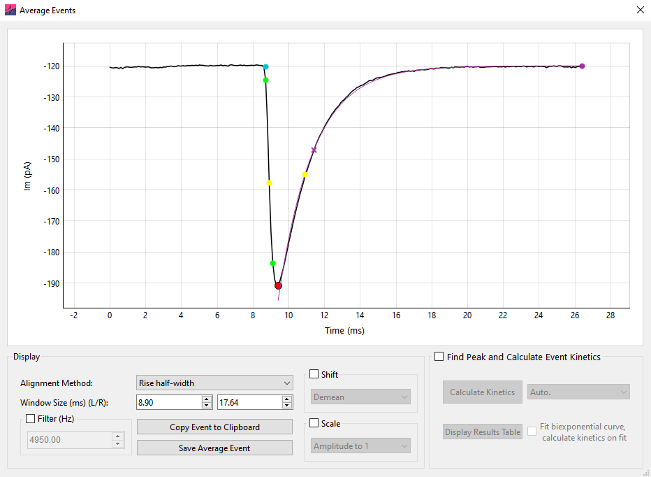
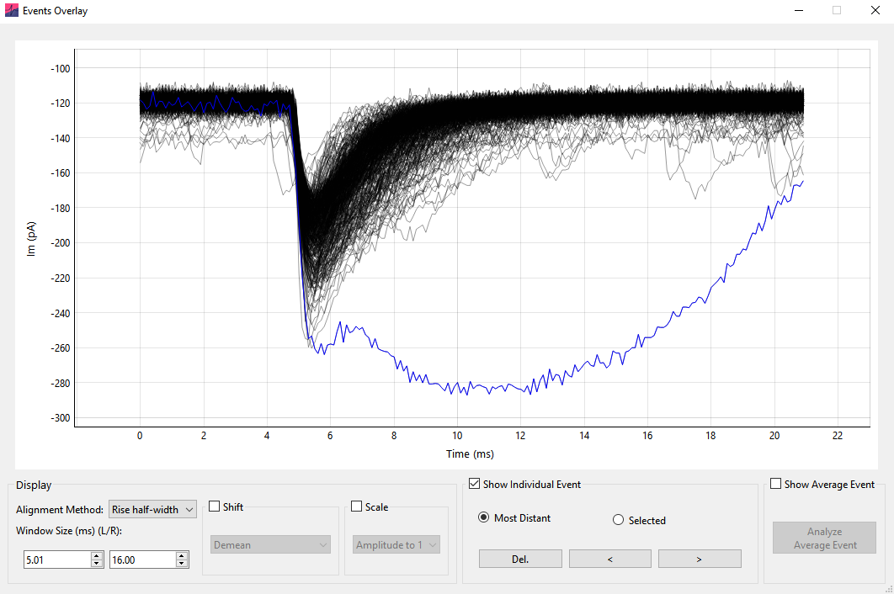
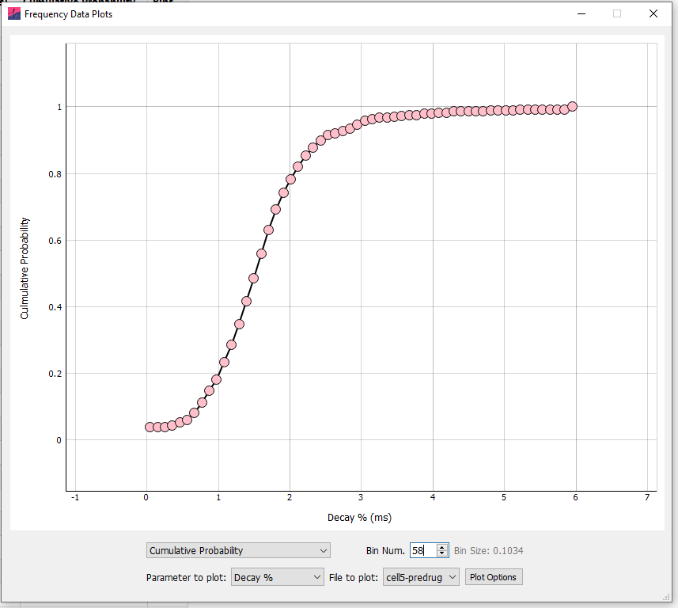

## Average event

### Analysis

Following events analysis an average event may be generated and analyzed. To generate an average event, click the [Average All Events]{.ui-label} button in the [*Analyze Events*](event-detection-and-analysis.qmd#event-detection-window-options) popup window (for both [*Template Matching*](event-detection-and-analysis.qmd#template-matching) and [*Thresholding*](event-detection-and-analysis.qmd#events-thresholding) analysis).

#### Generate an Average Event

{width="100%"}

To generate an average event, a point on each event is chosen to align ([Peak]{.ui-label}, [Rise half-width]{.ui-label}, or [Baseline]{.ui-label}). The data around this point is windowed and displayed in the *Average Events* window. If a window around an event extends further than the limits of the data, the event is excluded from analysis. This means that events to the extreme edge of the record are not included.

Click [Copy Event to Clipboard]{.ui-label} and [Save Average Event]{.ui-label} to copy or save (to `.xlsx` or `.csv`) the displayed data, respectively.

The averaged event can be filtered prior to analysis with the [Filter (Hz)]{.ui-label} box (8^th^ order Bessel). The averaged event can also be normalized using [Scale]{.ui-label} › [Amplitude to 1]{.ui-label} and [Shift]{.ui-label} › [Demean]{.ui-label}.

#### Analyze the Average Event

Click the [Find Peak and Calculate Event Kinetics]{.ui-label} button to start *Average Event* analysis. This will bring up a region on the plot that defines the analysis space.

The dropdown box to the right of the [Calculate Kinetics]{.ui-label} button can be used to set the baseline detection method. Set [Auto.]{.ui-label} for automatic baseline detection, or [Use Baseline]{.ui-label} to manually set the baseline. If [Use Baseline]{.ui-label} is selected, a baseline region will appear and can be moved to set the baseline for the data (This is analogous to the [Linear]{.ui-label} baseline during event detection).

To fit a biexponential function to the average event and calculate the kinetics on the function, select [Fit biexponential curve, calculate kinetics on fit]{.ui-label}. The region displayed on the graph can be used to define the fit start and end points.

The results of average event analysis can be viewed by clicking [Display Results Table]{.ui-label} and copied to the clipboard with the mouse and keyboard.

## Events overlay

The *Events Overlay* window displays all detected events on the same plot, providing a convenient way to find and remove outliers.

*Events Overlay* can be opened (after event detection has been performed) by clicking the [Overlay]{.ui-label} button on the [Events Analyze]{.ui-label} window. All detected events are shown overlaid on the plot in black. The display of the overlaid events can be adjusted with the [Alignment method]{.ui-label} and [Window size (ms)]{.ui-label} settings:

-   [Alignment method]{.ui-label} determines the point of the event used for alignment (e.g. the event peak).

-   [Window size (ms)]{.ui-label} controls the size of the window used to display the events (the displayed period prior to the peak is fixed, this setting controls the window from the peak to the right edge of the data).

### The Selected Event and Average Event

In the *Events Overlay* window, the currently selected individual event is shown in blue. When the window first opens, the individual event mode is set to [Selected]{.ui-label}. Clicking the left or right arrow buttons in [Selected]{.ui-label} mode will scroll through all events in numerical order. Changing the selected event through the *Events Overlay* window also scrolls through the individual events shown on the *Events Analysis* window, and vice versa.

{width="100%"}

Alternatively, individual events can be scrolled through in [Most Distant]{.ui-label} mode. The selected event will become the most distant event; here, distance is measured as the L2 norm from the average of all events. Clicking the left or right buttons will scroll through selected events based on their distance (in the order most to least distant). This can be a very useful way to detect and remove outlier events.

Further, individual events can be selected by clicking on them directly on the plot.

To remove an event from the analysis the [Del.]{.ui-label} button can be clicked on the *Events Overlay* window or the [Delete]{.ui-label} keyboard button pressed. The currently selected event will be removed from all analyses.

The average of all detected events can be displayed instead of the currently selected event by clicking [Show Average Event]{.ui-label}. Then, clicking [Analyze Average Event]{.ui-label} will open the analyze event dialog window, allowing analysis of the average event kinetics. This provides the possibility to shift and scale individual events prior to analysis of the average event.

### Shift and scale

The [Shift]{.ui-label} and [Scale]{.ui-label} options shift (add a constant) and scale (multiply by a constant) the individual events prior to presentation. When shift and scale operations are applied to data, scale operations are applied prior to shift operations.

#### [Shift]{.ui-label}

-   [Demean]{.ui-label} -- The mean of the event is subtracted (so the mean of the event becomes zero).

-   [Aligned param to zero]{.ui-label} -- The parameter used to align the events (e.g. rise half-width) is subtracted from the event (so that the aligned parameter value becomes zero).

-   [First sample to zero]{.ui-label} -- The first datapoint value of the event is subtracted (so the first sample of the event is zero).

#### [Scale]{.ui-label}

-   [Amplitude to 1]{.ui-label} -- The event is multiplied by a constant such that the amplitude (from most negative to most positive sample) becomes 1.

-   [Std. Dev. to 1]{.ui-label} -- The event is multiplied by a constant such that the standard deviation of the event becomes 1.

Note that the shift and scale operations are identical to those in the [*Average Event*](#average-event) window.

## Cumulative probability and histograms

Frequency data (as Histograms or Cumulative Probabilities) for all analyzed parameters can be calculated by selecting the check boxes on the Events [Table]{.ui-label} tab.

To specify how the frequency data is calculated click [Options]{.ui-label} › [Events]{.ui-label}. In the [Frequency Data]{.ui-label} section it is possible to select [Cumulative Probability]{.ui-label} or [Histogram]{.ui-label} format. Clicking [More Options]{.ui-label} will provide options for binning. These options will come into effect from the next analysis run (that is, re-run the analysis for the new options to take effect).

In the [More Options]{.ui-label} window, the binning method can be selected from the top drop-down menu. If [Auto.]{.ui-label}, the maximum of the Sturges or Freedman-Diaconis Estimation methods is used, as implemented in the NumPy method `histogram_bin_edges()`. In some instances, depending on the scaling and units of the data, this will erroneously return a very large number of bins -- in this case the square root method is used instead.

Alternatively, the number of bins can be set manually ([Custom Bin number]{.ui-label}), the size of the bins in the units of the relevant parameter can be set ([Custom Bin Size]{.ui-label}) or the number of bins can be a function of the total number of events ([total number of events divided by]{.ui-label}). Finally, the bin edges can be chosen as [Bin Centre]{.ui-label}, [Left Edge]{.ui-label}, or [Right Edge]{.ui-label} from the [X axis display]{.ui-label} drop-down menu.

For example, for bins spanning $0$--$1$, $1$--$2$, and $2$--$3$, the x-axis values are:

-   [Bin Centre]{.ui-label} -- $0.5$, $1.5$, $2.5$

-   [Left Edge]{.ui-label} -- $0$, $1$, $2$

-   [Right Edge]{.ui-label} -- $1$, $2$, $3$

Note that when calculating inter-event interval for multi-record files, the IEI between the last event of a record and first event of the following record will be ignored unless records are time-contiguous.

By default, frequency data is sorted on the table by value (e.g. smallest to largest amplitude). To sort by event number, right click the table header and select [Sort by Event Num.]{.ui-label}. At the bottom of the result table, the summary statistics for each column are shown.

### Frequency Data Plots

On the table tab, clicking [Plot Frequency Data]{.ui-label} will bring up the events frequency plots. Note that changing any of these options only changes the current display of the plot and not how the data is binned and presented in the table.

The data can be displayed as a histogram or cumulative probability plot, and any event parameter selected for display. If analysis is run in Batch Mode, any analyzed file can be selected for display. Finally, clicking [Plot Options]{.ui-label} allows customization of the plot, including removing the gridlines, setting marker and line color, size and X axis limits.