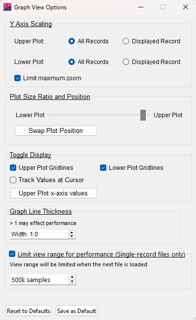

The graphs have a number of customizable display features for clear and convenient data visualization. These can be selected through [View]{.ui-label} › [Graph Options]{.ui-label}.

{width="400px"}

## Y-axis scaling

- [All Records]{.ui-label} -- scales the y-axis to the record with the largest range, keeping the scale consistent across the file.

- [Displayed Record]{.ui-label} -- rescales the y-axis whenever the displayed record changes. This can reduce performance when switching between records.

These options can be set independently for the [Upper Plot]{.ui-label} and [Lower Plot]{.ui-label}. Select [Limit maximum zoom]{.ui-label} to prevent excessive y-axis zooming.

## Plot size ratio and position

Use the slider to adjust the relative sizes of the upper and lower plots. [Swap Plot Position]{.ui-label} switches their positions without changing the primary data channel.

## Display options

- [Upper Plot Gridlines]{.ui-label} and [Lower Plot Gridlines]{.ui-label} -- show or hide gridlines independently on each plot.
- [Track Values at Cursor]{.ui-label} -- shows data values at the cursor position.
- [Upper Plot x-axis values]{.ui-label} -- shows or hides x-axis values on the upper plot.

## Graph line thickness

Use [Width]{.ui-label} to set the line thickness of the upper and lower plots. Values above the default of 1.0 can significantly reduce graphics performance.

## Limit the view range for performance

For single-record voltage-clamp data, the entire dataset can be displayed on the graph at once. Long recordings can contain large amounts of data and reduce performance. [Limit view range for performance (Single-record files only)]{.ui-label} sets a maximum window length so that only a subset of the data is shown.

The default limit is 500k samples. You can change the maximum window size or turn this option off. Changes take effect when the next file is loaded.
