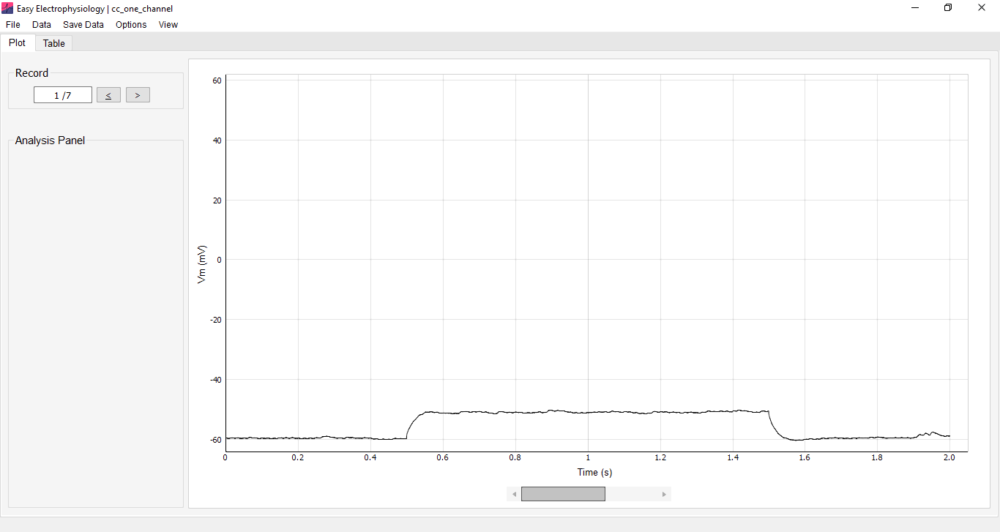

The 'Plot' and 'Table' views are the two main ways to visualize data and results in Easy Electrophysiology, accessed through the 'Plot' and 'Table' tabs (Fig. 1). The Plot tab is used to view voltage (Vm) and current (Im) traces, setup and run analysis and visualize the results. The 'Table' tab displays results in table format with options for saving to Excel or CSV.

To choose an analysis to run, click 'File' \> 'Open Analysis Window'. When an analysis type is selected, the 'Analysis Panel' on the left-hand side of the Plot tab will show the relevant options for running that analysis.

In the Table plot, options for saving analysis results can be found using the drop-down menu in the 'Save Table' box. Results can be saved as .xlsx (includes border formatting) or as .csv (no formatting). For some analyses (*Events*, *Action Potential Counting, Input Resistance*), checkboxes in the left-hand panel can be used to select which results to display.

*Zooming and Panning the Graph*

There are two zoom / pan modes available when using the Plot tab graph to explore your data. By default, 'One Button' mode is selected and you can zoom by clicking anywhere on the plot and dragging the mouse to draw a box to zoom in to. To un-zoom, you can right click on the graph and click \'Undo Zoom\'.

In the second mode, both mouse buttons can be used to navigate the graph. To access the second mode right-click anywhere on the graph and select \'Mouse Mode\' \> \'Two button (pan left, zoom right)\'. To zoom, hold down the right mouse button and drag the mouse to dynamically zoom in and out. To pan, click and hold down the left mouse button and drag to move the plot. You can still use \'Undo Zoom\' in this mode.
