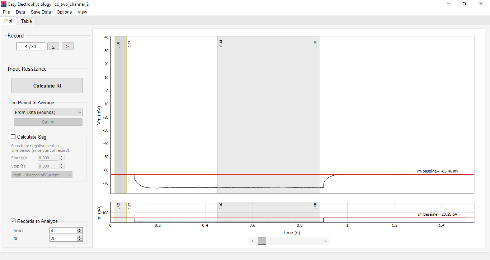

*Input Resistance* analysis provides a convenient interface for measuring the input resistance and voltage sag and hump in current-clamp mode.

To calculate input resistance, the changes in membrane voltage ($\Delta V_\mathrm{m}$) and membrane current ($\Delta I_\mathrm{m}$) must be determined from the data; $I_\mathrm{m}$ injections can also be entered manually. Input resistance is calculated as the slope of an ordinary least-squares linear fit, where $x = \Delta I_\mathrm{m}$ and $y = \Delta V_\mathrm{m}$, using SciPy's `linregress` with a fitted intercept. If only one record is analyzed, $R_\mathrm{i}$ is calculated as $\Delta V_\mathrm{m} / \Delta I_\mathrm{m}$.

For input resistance calculations, voltage is specified in $\mathrm{mV}$ and current in $\mathrm{nA}$, giving input resistance in $\mathrm{M\Omega}$.

Options for analyzing the voltage sag (for negative $I_\mathrm{m}$ injections) or hump (for positive $I_\mathrm{m}$ injections) are also provided.

## Calculating ΔVm and ΔIm

The [Im Period to Average]{.ui-label} menu provides three methods for obtaining $\Delta I_\mathrm{m}$ and $\Delta V_\mathrm{m}$:

-   [From Data (Bounds)]{.ui-label} -- Calculates $\Delta V_\mathrm{m}$ and $\Delta I_\mathrm{m}$ as the difference between data in the [Baseline]{.ui-label} and [Measure]{.ui-label} regions. These regions are displayed automatically on the $V_\mathrm{m}$ and $I_\mathrm{m}$ plots. The baseline is the mean between the two baseline-region boundaries and is displayed as a horizontal red line. The measured value is the mean of the data within the measure region.

	Alternatively, the current-injection protocol start and stop times can be used to position the baseline and measure regions.

-   [From Data (Start/Stop)]{.ui-label} -- Uses the known start and stop times of the current injection. Select this mode and click [Set Im]{.ui-label} to enter the times. The baseline is averaged from the start of the record to the start of the $I_\mathrm{m}$ injection, and the measured data are averaged from the start of the injection to its end.

	A padding of $n$ samples around the injection start and stop times accounts for a non-instantaneous $\Delta I_\mathrm{m}$. Set the padding under [Options]{.ui-label} › [Misc. Options]{.ui-label} › [Current Clamp User-Im Protocol Options]{.ui-label}; the default is $10$ samples.

-   [User-Input]{.ui-label} -- Allows current-injection steps to be entered directly in the case the trace is not available. Select this mode, click [Set Im]{.ui-label}, and enter the $I_\mathrm{m}$ injection for each record. The number of entered injections must match the number of records selected for analysis.

	For rheobase analysis in [*Action potential counting*](action-potential-counting.qmd), a ramp protocol can be specified for exact rheobase calculation by selecting the [Ramp]{.ui-label} tab and entering the current-stimulation protocol.

{width="100%"}

## Region and current options

-   [Round Im]{.ui-label} -- When current is calculated from the data, the measured $I_\mathrm{m}$ steps can be rounded according to the injection protocol. Select [Round Im]{.ui-label} from the [Im Options]{.ui-label} menu on the [Table]{.ui-label} tab. Although the rounding algorithm accounts for noise using the injection protocol, cross-check the rounded values for stray $I_\mathrm{m}$ measurements.

-   [Link Im to Vm]{.ui-label} -- When region boundaries are shown on both $V_\mathrm{m}$ and $I_\mathrm{m}$ plots, select [View]{.ui-label} › [Region Options]{.ui-label} › [Link Im to Vm]{.ui-label} to link their positions. Moving a $V_\mathrm{m}$ boundary then moves the corresponding $I_\mathrm{m}$ boundary, and vice versa. This option is off by default.

-   [Link Across Records]{.ui-label} -- This option links region-boundary positions across records. Moving a boundary on one record, such as Record $1$, moves the corresponding boundary on other records. When this option is off, each record's boundaries can be moved independently. Change it under [View]{.ui-label} › [Region Options]{.ui-label} › [Link Across Records]{.ui-label}. It is on by default.

![Input Resistance Results displayed on the [Table]{.ui-label} tab. [Plot Fit]{.ui-label} displays the linear fit used to calculate input resistance together with the line coefficients.](images/media/image27.PNG){width="100%"}

## Sag and hump analysis

Many neuronal types display a pronounced $V_\mathrm{m}$ deflection following negative (sag) or positive (hump) current injection that decays to the steady-state response. Options are provided for finding the sag or hump peak within a specified time window (the [Calculate Sag / Hump]{.ui-label} box).

The detected peak can follow the direction of the voltage deflection or be forced to always use a minimum or maximum. Select the method from [Calculate Sag / Hump]{.ui-label}:

-   [Peak - Direction of Current]{.ui-label} -- Uses a minimum for a negative $I_\mathrm{m}$ deflection and a maximum for a positive deflection.
-   [Peak - Always Minimum]{.ui-label} -- Always uses the minimum value in the search period.
-   [Peak - Always Maximum]{.ui-label} -- Always uses the maximum value in the search period.

The sag or hump position is marked on the plot with a red circle. Its peak voltage deflection is the difference between peak $V_\mathrm{m}$ and the steady-state $V_\mathrm{m}$ response. The sag or hump ratio is the sag or hump divided by the peak voltage deflection from baseline.

## Input resistance plot

A plot of $\Delta V_\mathrm{m}$ (y-axis) against $\Delta I_\mathrm{m}$ (x-axis), with the fitted line and coefficients, is available by clicking [Plot Fit]{.ui-label} on the [Table]{.ui-label} tab. This plot is available only when more than one record is analyzed.
