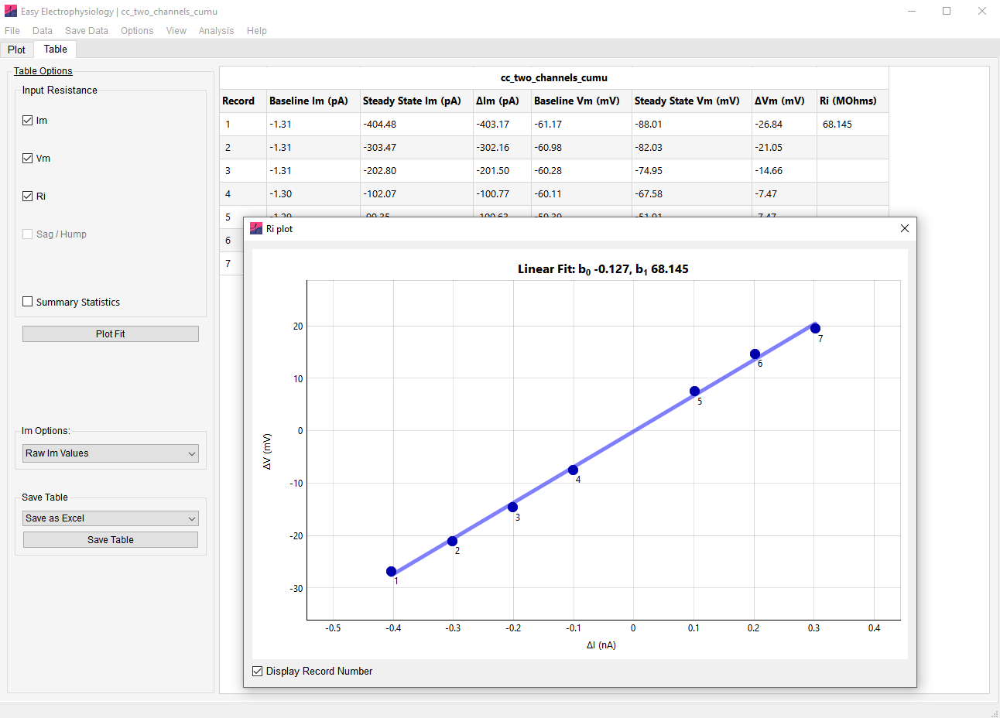

*Input Resistance* analysis provides a convenient interface for measuring the input resistance and voltage sag / hump in current-clamp mode.

To calculate input resistance the Vm change (ΔVm) and Im change (ΔIm) must be determined from the data (in the case of ΔIm these can also be input manually). The input resistance is calculated as the slope of a linear ordinary least squares fit, X = ΔIm, y = ΔVm (calculated with SciPy's *linregress,* modelling the intercept*).* If only one record is analyzed, Ri is calculated as V / I.

For input resistance calculations, voltage is specified in mV and current in nA so that input resistance is in MOhms.

Options for analyzing the voltage sag (for negative Im injections) or hump (for positive Im injections) are also provided.

## Calculating ΔVm and ΔIm

Two methods to calculate ΔVm and *ΔIm* from the data are provided:

*From Data (Bounds)*

The ΔVm and ΔIm are calculated as the difference between the data calculated within the 'measure and 'baseline' regions (Fig. 22). Baseline and measure regions are automatically displayed on the Vm and Im graphs. The baseline is calculated as the mean between the two boundaries of the baseline region -- the baseline is displayed on the graph as a horizontal red line. The measured data (Im or Vm) is calculated as the mean of the data contained within the 'measure' boundary region.

Alternatively, the Im injection protocol start / stop times can be used to set the baseline and measure regions.

*From Data (Start / Stop)*

The known start and stop times of the current injection can be input directly (by clicking 'From Data (Start / Stop)' in the dropdown menu and 'Set Im'). The baseline is calculated as the average from the start of the record to the start of the Im injection. The measured data is calculated as the average from the start of the Im injection to the end. A padding of *n* samples around the Im injection start and stop times is included to account for the non-

instantaneous ΔIm. The number of samples to pad the calculation can be set by clicking 'Options' \> 'Misc. Options' \> 'User-Im Protocol Options' (default 10).

## User Input Im

*User-Input*

Im injection steps can be input directly (rather than measured from the data). This is particularly useful if only the Vm channel was recoded. Switching to the 'User-Input' option in the dropdown menu on the *Input Resistance* panel and clicking 'Set Im'. The Im injection for each record can be input per row -- the number of Im injections input must match the number of records to analyze.

For rheobase analysis (*Action Potential Counting),* a ramp protocol can also be specified for 'exact' rheobase calculation by clicking the 'Ramp' tab and inputting the current stimulation protocol.

## Additional Options

*Round Im Injections*

If current is calculated from the data, the measured Im steps can be rounded based on the Im injection protocol using the drop-down menu on the 'Table' tab panel. Although the rounding algorithm tries to account for noise by incorporating the current injection protocol, it is recommended to cross-check these rounded values in case of stray Im measurements.

*Link Im to Vm*

When region boundaries are shown on both Vm and Im plots, their positions can be linked using the option 'Options' \> 'Boundary Options' \> 'Link Im to Vm'. In this mode, Im and Vm regions will be aligned and moving the Vm region boundaries will move the Im region boundaries, and vice-versa. By default, this option is turned off.

*Link Across Records*

{width="5.495485564304462in" height="3.9472222222222224in"}This option will link the position of region boundaries across records. That is, moving a region boundary on one record (e.g. Record 1) will also move its position on another record (e.g. Record 2). If off, moving a region boundary on one record will not affect its position on another record. This option can be changed at 'Options' \> 'Boundary Options' \> 'Link Across records' and is turned on by default.

## Sag / Hump Analysis

Many neuronal types display a pronounced Vm deflection following negative (sag) or positive (hump) current injection that decays to the steady-state response. Options are provided for finding the sag or hump peak within a specified time window (the 'Calculate Sag / Hump' box).

The peak detected can be in the same direction as the current injection (e.g. minimum if the Im injection is negative, maximum if positive) or forced always maximum / minimum. The desired option can be selected from the drop-down menu found in the 'Calculate Sag' box.

The Sag / Hump is position signified on the plot with a red circle. The sag or hump peak voltage deflection is calculated as the difference between peak Vm and steady state Vm response. The Sag / Hump ratio is defined as the sag (or hump) divided by the minimum (or maximum) voltage deflection from baseline.

## Input Resistance Plot

A ΔI / ΔV plot with line of best fit and displayed coefficients is available by clicking the 'Plot Ri' on the Panel in the Table tab (Fig. 23). Note that this is only available if more than 1 record is analyzed.
