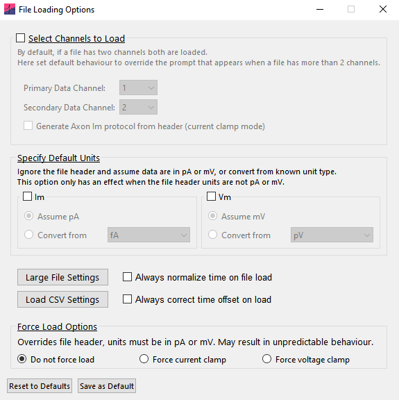
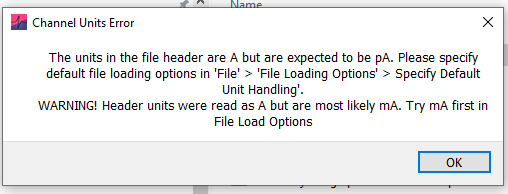
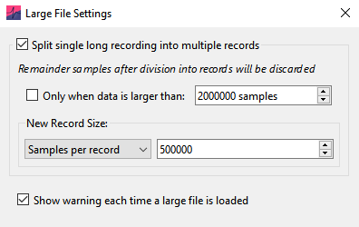
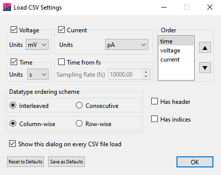

Axon (ABF-1, ABF-2), Axograph (.axgx, .axgd), HEKA (.dat), WinWCP / WinEDR (.wcp / .edr), Igor (.IBW), Spike2 (.smr) and comma-separated value (.csv) filetypes can be loaded into Easy Electrophysiology. Please get in contact if you have other filetypes you would like to see supported.

Files can be drag-and-dropped directly onto the main window or loaded by clicking 'File' \> 'Open File'. Note at the sampling frequency must be identical for all records in the file. Multiple files can also be loaded at once, and they will be concatenated together. A window for selecting the order and method by which the files are concatenated will appear.

For some .ABF files, all records may be erroneously concatenated to a single record (typically if exported from software that is not pClamp). If this occurs, please see the 'Reshape Records' or 'Large File Settings' section of this manual.

The following default file-loading options can be set on the File' \> 'File Loading Options menu (Fig. 2).

{width="4.277843394575678in" height="4.285283245844269in"}

## Select Channels to Load

Data from up to two channels can be loaded at once. The 'primary data channel' is the primary channel for all analysis (e.g. *Curve Fitting* is conducted on the primary data channel) and displayed in the upper graph. By default, the first channel in the file is selected as the primary data channel. The 'secondary data channel' is typically used for current / voltage injection protocols. In *Action Potential Counting* and *Input Resistance* analysis, Im values are calculated from the secondary data channel.

If the file contains more than two channels, default channels to load can be selected from the drop-down menu. To only load a single channel, set 'Secondary data channel' to 'None'.

*'Generate Axon Im protocol from header'* will generate the secondary data channel from Axon files in which the stimulus protocol is stored in the header, rather than in raw data. This option is only available in current clamp mode.

## Specify Default Units

Analysis routines expect units in seconds (s), picoamperes (pA) and millivolts (mV). If time units are detected as milliseconds (ms) in the file header, they will be automatically converted to seconds. If units are not in mV or pA, a window will warn that the file contains unexpected units. To load the file, click 'specify default values' and select the units to convert from the drop-down menu (e.g. if the file units are in A, select convert from A).

In some cases, the units specified in the file header do not match the true values. In this case, the dialog will also show a warning and an estimate of the true unit scaling (Fig. 3). Again select 'specify default values' and select the appropriate file units to convert from, or select 'Assume pA / mV' (e.g. if the file header is in units A and V but the data is scaled to pA or mV).

These options only have an effect when the file header is not in pA or mV.

## Always Normalize Time on File Load

Select this option to ignore when time is recorded as cumulatively increasing across records. See the 'Normalize Time' section of this manual for more details.

## Always Correct Time Offset on Load

On some recording setups, a small offset is added resulting in a non-zero starting timepoint (e.g. Record 1: 0.02 -- 1.52 s). If detected, a window will warn the user. To ignore this window and always correct time offset, select *'Always correct time offset on load'* option. This is recommended as small errors may be introduced when user-input times are required if the user is not aware of the offset. For example, a stimulus onset may be input as 0.1 s but due to the offset occur on the trace at 0.12 s.

## Force Analysis Mode (Voltage- vs. Current-clamp)

By default, the 'recording type' (current-clamp or voltage-clamp) is automatically detected based on the primary and secondary channel units in the file header. This determines which analyses are available to run (e.g. *Action Potential* analysis is only possible for current clamp recordings). Here automatic detection can be overridden and the selected analysis options will be available no matter the loaded filetype. Note that this may result in undefined behavior if incorrect analyses are conducted (e.g. *Action Potential Counting* on voltage-clamp data).

## Large File Settings

Large single-record files may run slowly when loaded into Easy Electrophysiology. Performance can be significantly improved by breaking a large single-record file into multiple smaller records.

The 'Large File Settings\` window (Fig. 4) on the file loading options allows configuration of how single-record files are reshaped on into multi-recording files on loading.

{width="4.125575240594926in" height="2.604529746281715in"}

If you want to keep large files as single record, you can turn off reshaping by unchecking 'Split single long recording into multiple records'. Alternatively, you can set how large (in samples) a file must be before it is reshaped using the 'Only when data is larger than:' checkbox.

The number of records that the file is reshaped into can be selected from the drop-down menu. The options include:

-   **Samples per record:** The number of samples per record the loaded file will have (i.e. after reshaping, default 500k).

-   **Num. records:** The number of records after reshaping.

-   **Optimal performance:** Find the record size closest to 500k samples (within 400--700k range) that minimizes the number of discarded samples.

-   **Time (s) per record:** The length of each record in seconds after reshaping.

By default, a warning is shown each time a files records are reshaped on load. This can be turned off using the 'Show warning each time a large file is loaded' checkbox.

## Load CSV Settings

'Comma separated value' (.csv) files can be loaded into Easy Electrophysiology. Due to the large variation in CSV formatting, the 'Load CSV Settings' window will be shown when attempting to configure loading for the CSV file layout. By accessing the 'Load CSV Settings'

{width="4.552083333333333in" height="3.6145833333333335in"}

from the 'File Loading Options' window, defaults can be set to avoid the window popping up on each CSV file load.

The first step is to indicate the channels in the file and their order. Channels may only be of type voltage, current or time. If there is not time data in the file, it can be created from a supplied sampling rate. As well as the type of channel in the data file, the order they are arranged in must also be specified (for example, if the CSV file is organized first all voltage channel data, then current channel data, the order will be 'voltage' then 'current').

*Interleaved* or *Consecutive*

Next it is necessary to specify whether the channels are organized *interleaved* or *consecutive*. *Interleaved* means that the data is that channel data is interleaved across records. For example, if you have a 5-record recording with three channels (voltage (v), current (c) and time (t) and record numbers 1, ..., 5), an *interleaved* organization would be (v1, c1, t1, v2, c2, t2, ..., v5, c5, t5). Alternatively, channels may be organized as groups, *consecutively* (v1, v2, ..., v5, c1, c2, ..., c5, t1, t2, ..., t5).

*Column-wise* vs. *Row-wise*

It is important to indicate the orientation in which separate channels / rows are arranged. If *column-wise*, each channel / record is a separate column and time increases along the row dimension. If *row-wise*, each channel / record is a separate row and time increases along the column dimension.

*Has header*

Select if channels / records have a column (if *column-wise* or row (if *row-wise*) header. The header will be ignored when loading the file. Only 1 row / column of header is supported, multi-line headers must be manually deleted before loading.

*Has indices*

Select if the time dimension has a column (if *row-wise)* or row (if column-wise) of indices (this will be ignored when loading the file).
