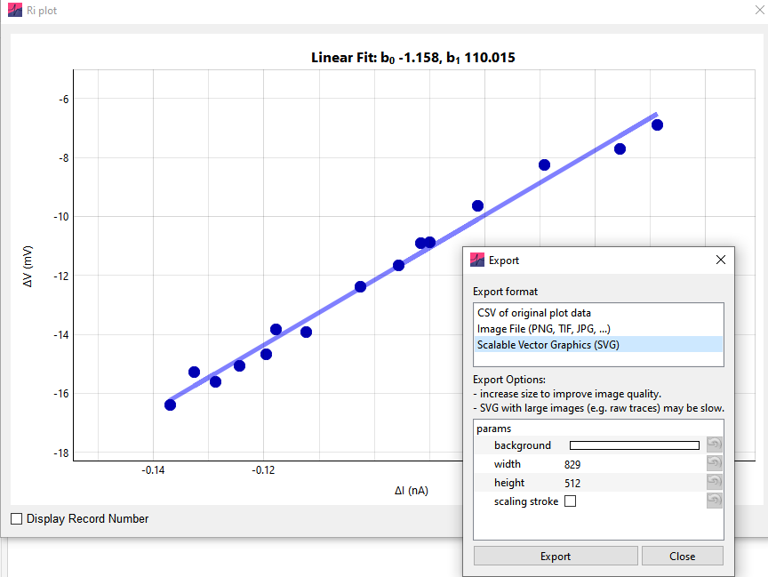

All figures in Easy Electrophysiology are exportable, through right-clicking the plot and selecting the 'Export' option. This window provides the option to export the plot data as a .csv (comma-separated value file), many possible standard image formats (including .jpeg, .png, .tiff, .bmp and more), or as .svg (scalable vector graphics) format.

The larger width and height of the exported data, the better quality the exported image will be. While the high-quality and editable .svg format is suitable for small data plots (e.g. the Ri plot, Fig 36.) but not raw data plots (as displayed on the main plot) as the resulting files will be very large and take a long time to save.

{width="4.865671478565179in" height="3.6491196412948383in"}
