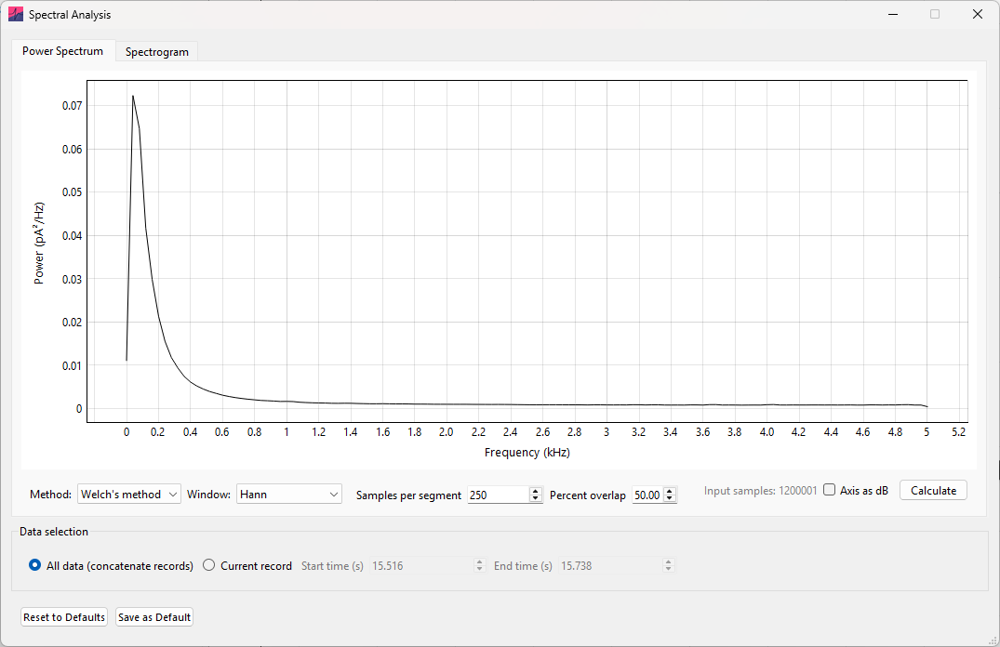
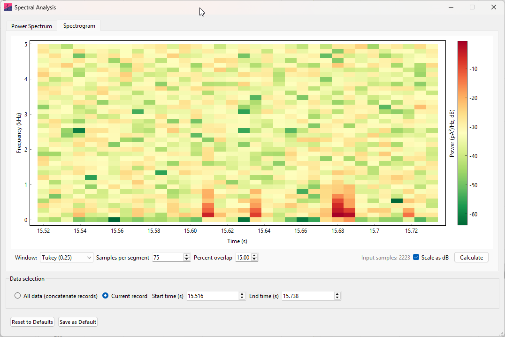
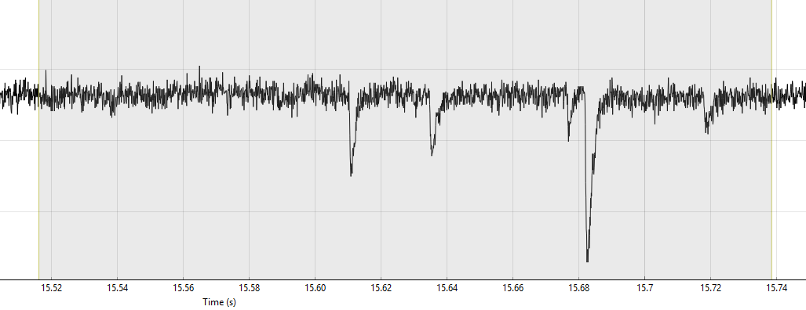

*Spectral Analysis* can be used to compute the power spectrum or spectrogram
of the primary channel data, revealing the frequency content of the signal.

Open the window by selecting [Analysis]{.ui-label} ›
[Spectral Analysis]{.ui-label}. The [Power Spectrum]{.ui-label} tab shows
power spectral density against frequency, while the [Spectrogram]{.ui-label}
tab shows how power at each frequency changes over time.

## Data selection

The frequency spectrum can be computed from the entire dataset or from a
subset of the data selected using a region:

- [All data (concatenate records)]{.ui-label} computes the power spectrum or
  spectrogram using all records concatenated into one continuous dataset.
  This option is available only when the records are time-contiguous.

- [Current record]{.ui-label} uses only the data within the displayed region on
  the current record for power spectrum or spectrogram computation.

## Power spectrum

{width="100%"}

The [Power Spectrum]{.ui-label} tab calculates power spectral density using
one of two methods:

- [Periodogram]{.ui-label} uses the Fourier transform of the complete selection
  to compute the power spectral density of the signal.

- [Welch's method]{.ui-label} divides the selection into overlapping segments
  and averages their spectra. Averaging reduces variability in the estimate,
  while shorter segments reduce frequency resolution.

The [Window]{.ui-label} provides a selection of standard windows (or no window)
to be applied to the signal before calculating the spectrum, to reduce
spectral leakage. 

[Axis as dB]{.ui-label} displays power in decibels,
calculated as $10 \times \log_{10}(\mathrm{power})$.

Welch's method also has the following additional parameters:

- [Samples per segment]{.ui-label} -- Sets the segment length for
  [Welch's method]{.ui-label}. Longer segments increase frequency resolution,
  while shorter segments provide more segments for averaging.

- [Percent overlap]{.ui-label} -- Sets the percentage of samples shared by
  adjacent Welch segments.

Once your parameters are chosen, click [Calculate]{.ui-label} to update the
plot.

## Spectrogram

The spectrogram can show how the frequency content of a signal changes over
time. It works by dividing the selected data into consecutive segments and
computing the power spectral density for each segment.

::: {#fig-spectrogram-example layout-ncol="1"}

{width="100%"}

{style="display: block; width: 87.27%; margin-left: 3.27%; margin-right: auto;"}

Spectrogram example. Power spectral density is displayed across time and
frequency. The selected data from which the spectrogram is computed is shown below it.

:::

The spectrogram has the following available parameters:

- [Window]{.ui-label} -- Applies the selected window function to each segment.

- [Samples per segment]{.ui-label} -- Sets the segment length. Longer segments
  improve frequency resolution but reduce time resolution; shorter segments
  improve time resolution but reduce frequency resolution.

- [Percent overlap]{.ui-label} -- Sets the percentage of samples shared by
  adjacent segments. Increasing overlap gives more closely spaced time points
  but increases calculation time.

- [Scale as dB]{.ui-label} -- Displays power in decibels, calculated as
  $10 \times \log_{10}(\mathrm{power})$, rather than on a linear scale.

As with the power spectrum, click [Calculate]{.ui-label} to update the plot.
